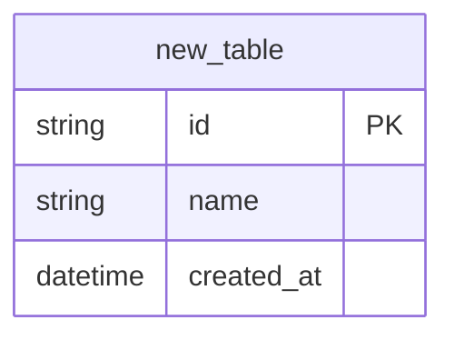
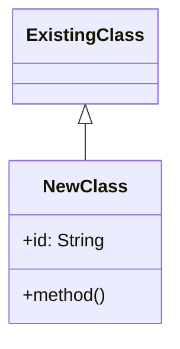
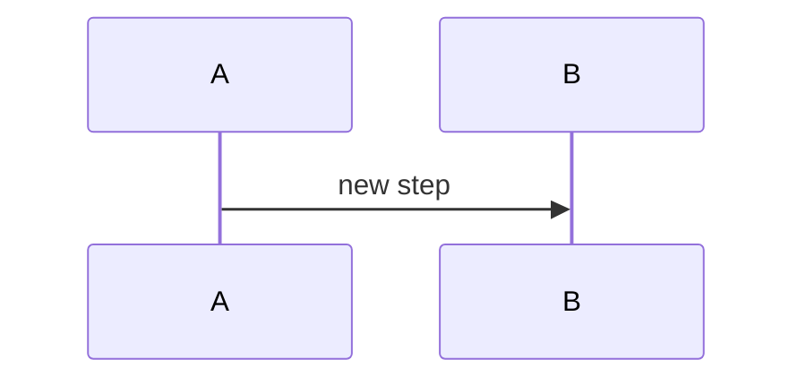

---
globs:
  - "claude-flow-core/**/*.kt"
  - "claude-flow-api/**/*.kt"
  - "claude-flow-executor/**/*.kt"
  - "claude-flow-app/**/*.kt"
  - "build.gradle.kts"
  - "**/build.gradle.kts"
  - "docker-compose/**/*.yml"
---

# Documentation Auto-Update Rules

이 규칙은 코드 변경 시 문서 동기화를 위한 가이드라인입니다.

## 자동 문서화 트리거

### Repository 클래스 (storage/repository/*.kt)
- **트리거**: 새 파일 생성 또는 클래스 이름 변경
- **업데이트 대상**:
  - `CLAUDE.md` > 모듈 구조 > `repository/` 섹션
  - `docs/ARCHITECTURE.md` > 스토리지 계층 ER 다이어그램
- **템플릿**: `│   │       ├── {ClassName}.kt`

### Plugin 클래스 (plugin/*.kt)
- **트리거**: 새 플러그인 생성
- **업데이트 대상**:
  - `CLAUDE.md` > 모듈 구조 > `plugin/` 섹션
  - `docs/ARCHITECTURE.md` > 플러그인 시스템 클래스 다이어그램
  - `config/plugins.toml` (설정 추가)
- **템플릿**: `│   │   ├── {ClassName}.kt`

### Routing 클래스 (routing/*.kt)
- **트리거**: 라우팅 로직 변경 또는 새 라우터 추가
- **업데이트 대상**:
  - `CLAUDE.md` > 모듈 구조 > `routing/` 섹션
  - `docs/ARCHITECTURE.md` > 에이전트 라우팅 파이프라인 다이어그램

### API Controller (rest/*Controller.kt)
- **트리거**: 새 컨트롤러 또는 엔드포인트 추가
- **업데이트 대상**:
  - `CLAUDE.md` > 자주 수정하는 파일 테이블
  - `README.md` > API 엔드포인트 테이블
  - `docs/ARCHITECTURE.md` > REST API 엔드포인트 섹션

### 빌드 설정 (build.gradle.kts)
- **트리거**: 의존성 추가/제거, 버전 변경
- **업데이트 대상**:
  - `CLAUDE.md` > 기술 스택 테이블
  - `docs/ARCHITECTURE.md` > 전체 기술 스택 마인드맵

### Docker 설정 (docker-compose/*.yml)
- **트리거**: 서비스 추가/제거, 포트 변경
- **업데이트 대상**:
  - `docs/ARCHITECTURE.md` > 배포 아키텍처 다이어그램
  - `README.md` > 설치 가이드

## 문서화 체크리스트

코드 작성 완료 후 다음을 확인하세요:

### 새 파일 생성 시
- [ ] 클래스/인터페이스에 KDoc 주석 추가
- [ ] CLAUDE.md 모듈 구조에 파일 추가
- [ ] 관련 Mermaid 다이어그램 업데이트

### 기존 파일 수정 시
- [ ] 주요 로직 변경 시 인라인 주석 업데이트
- [ ] public API 변경 시 KDoc 업데이트
- [ ] 아키텍처 변경 시 다이어그램 업데이트

### API 변경 시
- [ ] 엔드포인트 추가/변경 시 README.md 업데이트
- [ ] 요청/응답 스키마 변경 시 문서화

## 자동화 명령

```bash
# 문서 동기화 상태 확인
/sync-docs

# 전체 문서 업데이트
/update-docs
```

## Mermaid 다이어그램 업데이트 가이드

### ER 다이어그램에 새 엔티티 추가


### 클래스 다이어그램에 새 클래스 추가


### 시퀀스 다이어그램에 새 단계 추가

