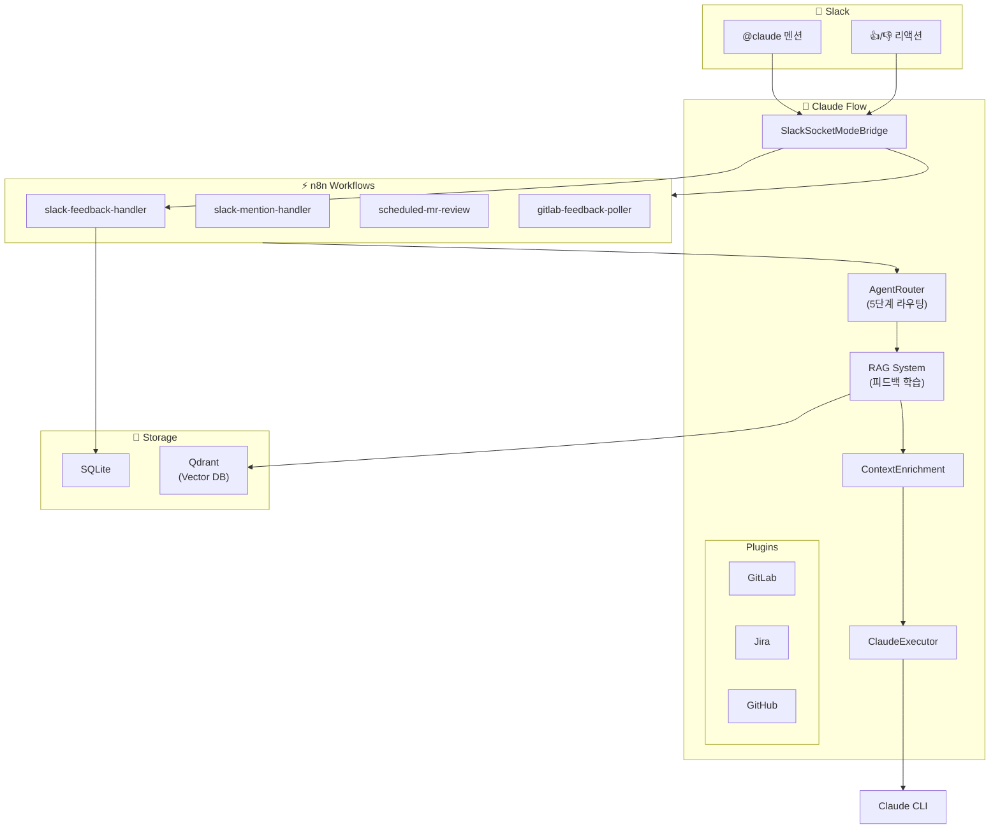

# Claude Flow

Slack에서 Claude를 호출하고, GitLab MR 리뷰를 자동화하는 AI 에이전트 플랫폼입니다.

## ✨ 프로젝트 특징

### 🔀 n8n + Kotlin 하이브리드 아키텍처

Claude Flow의 가장 큰 특징은 **n8n 워크플로우 엔진**과 **Kotlin 백엔드**의 유기적 결합입니다.

```
┌─────────────────────────────────────────────────────────────────────┐
│                        Slack Event (Socket Mode)                    │
└─────────────────────────────┬───────────────────────────────────────┘
                              │
                              ▼
┌─────────────────────────────────────────────────────────────────────┐
│  Kotlin (SlackSocketModeBridge)                                     │
│  - WebSocket 연결 관리, 자동 재연결                                  │
│  - 이벤트 분류 및 라우팅                                             │
└─────────────────────────────┬───────────────────────────────────────┘
                              │ Webhook
                              ▼
┌─────────────────────────────────────────────────────────────────────┐
│  n8n (Visual Workflow)                                              │
│  - 메시지 분류 (Command / MR Review / General)                      │
│  - 스레드 히스토리 조회 → Kotlin API 호출                            │
│  - Claude 실행 → Kotlin API 호출                                    │
│  - Slack 응답 전송 → Kotlin API 호출                                │
│  - 피드백 수집 및 저장                                              │
└─────────────────────────────┬───────────────────────────────────────┘
                              │ HTTP
                              ▼
┌─────────────────────────────────────────────────────────────────────┐
│  Kotlin (Core Services)                                             │
│  - AgentRouter: 5단계 지능형 라우팅                                 │
│  - ContextEnrichment: RAG 기반 컨텍스트 증강                        │
│  - ClaudeExecutor: Claude CLI 실행 및 세션 관리                     │
│  - Storage: SQLite + Qdrant 저장소                                  │
└─────────────────────────────────────────────────────────────────────┘
```

#### 왜 이 아키텍처인가?

| Kotlin (코드) | n8n (워크플로우) |
|---------------|-----------------|
| 핵심 비즈니스 로직 | 이벤트 오케스트레이션 |
| 에이전트 라우팅, RAG | 메시지 분류, 조건 분기 |
| API 엔드포인트 | 외부 서비스 연동 흐름 |
| 빌드/배포 필요 | **UI에서 즉시 수정** |
| 타입 안전성, 성능 | **시각적 디버깅, 실행 히스토리** |

#### n8n의 장점

1. **시각적 워크플로우 편집**: 복잡한 흐름을 드래그&드롭으로 수정
2. **실행 히스토리**: 모든 실행의 입출력을 UI에서 확인
3. **즉시 배포**: 코드 재빌드 없이 워크플로우 수정 적용
4. **에러 디버깅**: 실패한 노드와 데이터를 즉시 확인

#### 로컬 환경에서의 성능

n8n과 Kotlin 간의 HTTP 호출은 **로컬 네트워크**에서 이루어지므로:
- 단일 HTTP 홉: **1-5ms** (무시 가능)
- 실제 병목: Claude CLI 실행 (**5-30초**)
- 결론: **아키텍처 오버헤드 < 0.01%**

---

## 주요 기능

- **Slack 연동**: `@claude` 멘션으로 Claude와 대화
- **GitLab MR 리뷰**: `@claude project-name !123 리뷰해줘`로 자동 코드 리뷰
- **Jira 연동**: AI 기반 이슈 분석, 자연어 JQL 변환, 스프린트 리포트 자동 생성
- **실시간 스트리밍 채팅**: SSE 기반 실시간 응답 스트리밍
- **지능형 라우팅**: 키워드 → 시맨틱 → LLM 폴백 3단계 라우팅
- **플러그인 시스템**: GitLab, Jira, GitHub, n8n 플러그인 확장
- **프로젝트 관리**: 프로젝트별 에이전트, 채널 매핑, Rate Limiting
- **사용자 컨텍스트**: 대화 기록 요약, 개인별 선호도/규칙 저장
- **실시간 분석**: P50/P90/P95/P99 통계, 시계열 차트, 피드백 분석
- **n8n 워크플로우**: 자연어로 워크플로우 자동 생성, 유연한 이벤트 처리
- **RAG 시스템**: Qdrant + Ollama 기반 지능형 컨텍스트 증강
  - 대화 기반 학습 및 유사 쿼리 검색
  - 피드백 학습 기반 에이전트 라우팅
  - 코드베이스 인덱싱 및 MR 리뷰 컨텍스트 제공
  - 자동 요약 생성 및 세션 관리

### Dashboard 기능

| 페이지 | 기능 |
|--------|------|
| Dashboard | 실시간 통계, P50/P90/P95/P99 백분위수, 피드백 분석, 모델별 사용량 |
| Jira | Jira 이슈 관리, AI 분석, 자연어 JQL, Smart Issue Creator |
| Chat | 웹 기반 채팅 인터페이스 |
| Activity | 실행 이력, 피드백 관리, GitLab AI 리뷰 |
| Live Logs | 실시간 로그 스트리밍 |
| Knowledge | 코드베이스 인덱싱, RAG 시스템 관리 |
| Workflows | n8n 워크플로우 관리/생성 |
| Settings | 환경변수 설정, 프로젝트 관리 |

### 에이전트 및 모델

| 에이전트 | 모델 | 용도 |
|---------|------|------|
| general | claude-sonnet-4 | 일반 질문, 설명 |
| code-reviewer | **claude-opus-4** | MR/PR 코드 리뷰 (고품질) |
| bug-fixer | **claude-opus-4** | 버그 분석 및 수정 (정확도) |
| refactor | claude-sonnet-4 | 코드 리팩토링 |

### 자동 MR 리뷰

5분마다 GitLab MR을 자동으로 리뷰하는 기능:

```
scheduled-mr-review 워크플로우
    ↓ 5분마다 실행
GitLab 프로젝트 MR 목록 조회
    ↓ ai-review 라벨 없는 MR 필터링
Claude Opus로 코드 리뷰 실행
    ↓
GitLab 코멘트로 리뷰 결과 게시
    ↓
ai-review::done 라벨 적용
```

- **대상**: `develop` 브랜치로 향하는 MR
- **필터**: `ai-review::done`, `ai-review::skip` 라벨 없는 MR
- **모델**: Claude Opus (고품질 리뷰)

## 빠른 시작

### 사전 요구사항

- Docker & Docker Compose
- Slack 워크스페이스 (앱 설치 권한)
- Claude CLI 인증 (`claude login` 완료)

### 1. 저장소 클론

```bash
git clone https://github.com/Gyeom/claude-flow.git
cd claude-flow

# Git Hooks 설치 (선택 - 문서 자동 업데이트 활성화)
./scripts/install-hooks.sh
```

### 2. Slack 앱 생성

1. [Slack API](https://api.slack.com/apps) 접속 → **Create New App** → **From scratch**
2. 앱 이름: `Claude Flow`, 워크스페이스 선택

3. **Socket Mode** 활성화:
   - Settings > Socket Mode > Enable Socket Mode
   - App-Level Token 생성 (scope: `connections:write`)
   - **xapp-xxx** 토큰 복사

4. **Bot Token Scopes** 추가 (OAuth & Permissions):
   ```
   app_mentions:read    - @멘션 읽기
   chat:write           - 메시지 전송
   reactions:read       - 리액션 읽기
   reactions:write      - 리액션 추가
   im:history           - DM 기록 읽기
   im:read              - DM 접근
   im:write             - DM 전송
   ```

5. **Event Subscriptions** 활성화:
   - Subscribe to bot events: `app_mention`, `message.im`

6. **워크스페이스에 앱 설치** → **xoxb-xxx** 토큰 복사

7. Basic Information에서 **Signing Secret** 복사

### 3. 환경 설정

```bash
cd docker-compose
cp .env.example .env
```

`.env` 파일 편집:
```bash
# 필수 - Slack
SLACK_APP_TOKEN=xapp-1-xxx          # Socket Mode 토큰
SLACK_BOT_TOKEN=xoxb-xxx            # Bot 토큰
SLACK_SIGNING_SECRET=xxx            # Signing Secret

# Claude 설정
CLAUDE_MODEL=claude-sonnet-4-20250514  # 사용할 모델
CLAUDE_TIMEOUT=300                      # 타임아웃 (초)

# 선택 - GitLab (MR 리뷰 기능)
GITLAB_URL=https://gitlab.example.com
GITLAB_TOKEN=glpat-xxx              # api scope 권한 필요
GITLAB_GROUP=my-org/my-group        # 그룹 경로 (멀티 프로젝트 쿼리용)

# 선택 - Jira
JIRA_URL=https://your-org.atlassian.net
JIRA_EMAIL=your-email@example.com
JIRA_API_TOKEN=xxx                  # API 토큰

# 선택 - RAG (벡터 검색, 컨텍스트 증강)
RAG_ENABLED=true
QDRANT_URL=http://qdrant:6333
OLLAMA_URL=http://ollama:11434
OLLAMA_EMBEDDING_MODEL=qwen3-embedding:0.6b  # MTEB #1 모델 (1024차원)
```

### 4. 실행

```bash
# 프로젝트 루트에서
./start.sh
```

또는 수동 실행:
```bash
cd docker-compose
docker compose up -d
```

### 5. 확인

```bash
# 서비스 상태
./start.sh --status

# 로그 확인
./start.sh --logs
```

**접속 URL:**
- API: http://localhost:8080
- Dashboard: http://localhost:3000
- n8n: http://localhost:5678 (admin@local.dev / Localdev123)

### 6. 사용

Slack에서:
```
@claude 안녕하세요!
@claude authorization-server !42 리뷰해줘
```

## Claude CLI 인증

Claude Flow는 [Claude CLI](https://docs.anthropic.com/en/docs/claude-code)를 사용합니다. API 키가 아닌 CLI 인증 방식입니다.

### 로컬 개발 시

```bash
# Claude CLI 설치
npm install -g @anthropic-ai/claude-code

# 인증 (브라우저에서 로그인)
claude login
```

### Docker 환경

Docker 컨테이너에서 Claude CLI를 사용하려면 인증 정보를 마운트해야 합니다:

```yaml
# docker-compose.yml에 추가
volumes:
  - ~/.claude:/home/appuser/.claude:ro
```

## 로컬 개발 (Docker 없이)

```bash
# 1. 빌드
./gradlew build

# 2. 환경변수 설정
export SLACK_APP_TOKEN=xapp-xxx
export SLACK_BOT_TOKEN=xoxb-xxx
export SLACK_SIGNING_SECRET=xxx

# 3. 실행
./gradlew :claude-flow-app:bootRun

# 4. 대시보드 (별도 터미널)
cd dashboard
npm install
npm run dev
```

## 아키텍처



**핵심 흐름:**
1. **Slack 멘션** → SlackSocketModeBridge → n8n Webhook
2. **에이전트 라우팅** (피드백 학습 → 키워드 → 패턴 → 시맨틱 → 폴백)
3. **컨텍스트 증강** (프로젝트, 사용자 규칙, RAG 유사 대화)
4. **Claude 실행** → 응답 → Slack 전송
5. **피드백 수집** (👍/👎) → 학습 → 다음 라우팅 개선

## 프로젝트 구조

```
claude-flow/
├── claude-flow-core/       # 도메인 모델, 라우팅, 스토리지
├── claude-flow-executor/   # Claude CLI 래퍼
├── claude-flow-api/        # REST API
├── claude-flow-app/        # Spring Boot 앱 (Slack 연동)
├── dashboard/              # React 대시보드
├── docker-compose/         # Docker 설정
│   ├── .env.example        # 환경변수 템플릿
│   ├── docker-compose.yml  # 서비스 정의
│   └── n8n-workflows/      # n8n 워크플로우 JSON
└── start.sh                # 원클릭 실행 스크립트
```

## API

### Execute & Chat
| Method | Endpoint | 설명 |
|--------|----------|------|
| POST | `/api/v1/execute-with-routing` | 라우팅 + 실행 통합 |
| POST | `/api/v1/chat/stream` | SSE 스트리밍 채팅 |
| POST | `/api/v1/chat/execute` | 비스트리밍 채팅 (권장) |
| GET | `/api/v1/health` | 헬스체크 |

### Projects
| Method | Endpoint | 설명 |
|--------|----------|------|
| GET | `/api/v1/projects` | 프로젝트 목록 |
| POST | `/api/v1/projects` | 프로젝트 생성 |
| GET | `/api/v1/projects/{id}` | 프로젝트 조회 |
| PATCH | `/api/v1/projects/{id}` | 프로젝트 수정 |
| DELETE | `/api/v1/projects/{id}` | 프로젝트 삭제 |
| GET | `/api/v1/projects/{id}/agents` | 프로젝트 에이전트 목록 |
| POST | `/api/v1/projects/{id}/channels` | 채널 매핑 |
| GET | `/api/v1/projects/{id}/stats` | 프로젝트 통계 |

### Agents (v1 & v2)
| Method | Endpoint | 설명 |
|--------|----------|------|
| GET | `/api/v1/agents` | 에이전트 목록 |
| POST | `/api/v1/agents` | 에이전트 생성 |
| GET | `/api/v2/agents` | 에이전트 목록 (v2) |
| GET | `/api/v2/agents/{id}` | 에이전트 조회 |
| PATCH | `/api/v2/agents/{id}` | 에이전트 수정 |
| DELETE | `/api/v2/agents/{id}` | 에이전트 삭제 |

### Analytics
| Method | Endpoint | 설명 |
|--------|----------|------|
| GET | `/api/v1/analytics/dashboard` | 대시보드 데이터 |
| GET | `/api/v1/analytics/overview` | P50/P90/P95/P99 통계 |
| GET | `/api/v1/analytics/percentiles` | 백분위수 조회 |
| GET | `/api/v1/analytics/timeseries` | 시계열 데이터 |
| GET | `/api/v1/analytics/models` | 모델별 통계 |
| GET | `/api/v1/analytics/errors` | 에러 통계 |
| GET | `/api/v1/analytics/users` | 사용자별 통계 |
| GET | `/api/v1/analytics/feedback/verified` | 검증된 피드백 통계 |

### Users
| Method | Endpoint | 설명 |
|--------|----------|------|
| GET | `/api/v1/users` | 사용자 목록 |
| GET | `/api/v1/users/{userId}` | 사용자 상세 |
| GET | `/api/v1/users/{userId}/context` | 사용자 컨텍스트 |
| PUT | `/api/v1/users/{userId}/context` | 컨텍스트 저장 |
| GET | `/api/v1/users/{userId}/rules` | 규칙 조회 |
| POST | `/api/v1/users/{userId}/rules` | 규칙 추가 |
| GET | `/api/v1/users/{userId}/context/formatted` | 포맷팅된 컨텍스트 |

### System
| Method | Endpoint | 설명 |
|--------|----------|------|
| GET | `/api/v1/system/health` | 시스템 상태 |
| GET | `/api/v1/system/slack/status` | Slack 연결 상태 |
| POST | `/api/v1/system/slack/reconnect` | Slack 재연결 |

### Jira Analysis (AI 기반)
| Method | Endpoint | 설명 |
|--------|----------|------|
| POST | `/api/v1/jira/analyze/{issueKey}` | 이슈 분석 및 구현 방향 제안 |
| POST | `/api/v1/jira/analyze/{issueKey}/code-context` | 관련 코드 분석 |
| POST | `/api/v1/jira/sprint-report` | 스프린트 리포트 생성 |
| POST | `/api/v1/jira/nl-to-jql` | 자연어 → JQL 변환 |
| POST | `/api/v1/jira/auto-label/{issueKey}` | 자동 라벨링 |
| POST | `/api/v1/jira/analyze-text` | 텍스트 → 이슈 필드 제안 |

### Plugins
| Method | Endpoint | 설명 |
|--------|----------|------|
| GET | `/api/v1/plugins` | 플러그인 목록 |
| GET | `/api/v1/plugins/{id}` | 플러그인 상세 |
| POST | `/api/v1/plugins/{id}/execute` | 플러그인 명령 실행 |
| PATCH | `/api/v1/plugins/{id}/enabled` | 활성화/비활성화 |
| GET | `/api/v1/plugins/gitlab/mrs` | GitLab MR 목록 |
| GET | `/api/v1/plugins/jira/issues/{key}` | Jira 이슈 조회 |
| POST | `/api/v1/plugins/jira/issues` | Jira 이슈 생성 |
| GET | `/api/v1/plugins/jira/search` | Jira JQL 검색 |

### n8n Workflows
| Method | Endpoint | 설명 |
|--------|----------|------|
| GET | `/api/v1/n8n/workflows` | 워크플로우 목록 |
| GET | `/api/v1/n8n/workflows/{id}` | 워크플로우 상세 |
| POST | `/api/v1/n8n/workflows/generate` | 자연어로 워크플로우 생성 |
| POST | `/api/v1/n8n/workflows/template/{id}` | 템플릿 기반 생성 |
| GET | `/api/v1/n8n/templates` | 사용 가능한 템플릿 목록 |
| POST | `/api/v1/n8n/workflows/{id}/run` | 워크플로우 실행 |
| PATCH | `/api/v1/n8n/workflows/{id}/active` | 활성화/비활성화 |

### GitLab RAG (MR 리뷰)
| Method | Endpoint | 설명 |
|--------|----------|------|
| POST | `/api/v1/plugins/gitlab/execute` | GitLab 명령 실행 |
| - | `command: mr-review` | RAG 기반 MR 리뷰 |
| - | `command: index-project` | 프로젝트 코드 인덱싱 |
| - | `command: knowledge-stats` | 인덱싱 통계 조회 |

## RAG 시스템

### 개요

Claude Flow의 RAG(Retrieval-Augmented Generation) 시스템은 세 가지 핵심 기능을 제공합니다:

1. **피드백 학습 기반 라우팅**: 사용자 피드백을 분석하여 유사한 쿼리에 최적의 에이전트 자동 선택
2. **컨텍스트 증강**: 과거 대화와 사용자 규칙을 벡터 검색하여 프롬프트에 자동 주입
3. **코드 지식 베이스**: 프로젝트 코드를 인덱싱하여 MR 리뷰 시 관련 코드 컨텍스트 제공

### 구성 요소

```
┌─────────────────────────────────────────────────────────────┐
│                    RAG 아키텍처                              │
├─────────────────────────────────────────────────────────────┤
│  Embedding: Ollama (qwen3-embedding:0.6b, 1024차원)         │
│  Vector DB: Qdrant                                          │
│  Collections: conversations, knowledge                       │
├─────────────────────────────────────────────────────────────┤
│  Services:                                                   │
│  • EmbeddingService      - 텍스트 → 벡터 변환               │
│  • ConversationVectorService - 대화 인덱싱/검색             │
│  • CodeKnowledgeService  - 코드 인덱싱/검색                 │
│  • ContextAugmentationService - 프롬프트 증강               │
│  • FeedbackLearningService - 피드백 학습                    │
│  • AutoSummaryService    - 자동 요약 생성                   │
└─────────────────────────────────────────────────────────────┘
```

### 라우팅 파이프라인

```
사용자 메시지
    │
    ▼
┌───────────────────┐
│ 피드백 학습 검색   │ ← 유사 쿼리 분석 (confidence 0.9)
└─────────┬─────────┘
          │ 매칭 실패
          ▼
┌───────────────────┐
│ 키워드 매칭       │ ← 정확한 키워드 (confidence 0.95)
└─────────┬─────────┘
          │ 매칭 실패
          ▼
┌───────────────────┐
│ 정규식 패턴 매칭   │ ← 패턴 분석 (confidence 0.85)
└─────────┬─────────┘
          │ 매칭 실패
          ▼
┌───────────────────┐
│ 시맨틱 검색       │ ← 벡터 유사도 (선택적)
└─────────┬─────────┘
          │ 매칭 실패
          ▼
┌───────────────────┐
│ 기본 에이전트     │ ← 폴백 (confidence 0.5)
└───────────────────┘
```

### MR 리뷰 with RAG

```bash
# 1. 프로젝트 코드 인덱싱 (최초 1회)
curl -X POST http://localhost:8080/api/v1/plugins/gitlab/execute \
  -H "Content-Type: application/json" \
  -d '{"command": "index-project", "args": {"project": "my-org/my-project", "branch": "main"}}'

# 2. RAG 기반 MR 리뷰
curl -X POST http://localhost:8080/api/v1/plugins/gitlab/execute \
  -H "Content-Type: application/json" \
  -d '{"command": "mr-review", "args": {"project": "my-org/my-project", "mr_id": 123}}'
```

리뷰 결과에는 다음이 포함됩니다:
- 자동 검출된 보안/성능/스타일 이슈
- 관련 코드베이스 참조 (벡터 유사도 기반)
- Claude용 컨텍스트 프롬프트

### 임베딩 모델

| 모델 | 차원 | 특징 |
|------|------|------|
| qwen3-embedding:0.6b | 1024 | MTEB Multilingual 1위, Code 1위 (권장) |
| nomic-embed-text | 768 | 경량, 빠름 |
| bge-m3 | 1024 | 다국어 우수 |

## 문제 해결

### Slack 연결 실패

```bash
# 토큰 확인
echo $SLACK_BOT_TOKEN

# Socket Mode 활성화 여부 확인
# Slack API > Settings > Socket Mode > Enabled
```

### Claude CLI 인증 오류

```bash
# 인증 상태 확인
claude --version

# 재인증
claude logout
claude login
```

### n8n 워크플로우 미작동

1. http://localhost:5678 접속
2. 워크플로우 목록에서 활성화 상태 확인 (토글 ON)
3. Webhook URL이 올바른지 확인

### 포트 충돌

```bash
# 사용 중인 포트 확인
lsof -i :8080
lsof -i :5678

# 프로세스 종료
kill -9 <PID>
```

## 명령어 모음

```bash
./start.sh              # 인터랙티브 설정 + 시작
./start.sh --quick      # 기존 설정으로 빠른 시작
./start.sh --stop       # 서비스 중지
./start.sh --status     # 상태 확인
./start.sh --logs       # 로그 확인
./start.sh --backup     # n8n 워크플로우 백업
./start.sh --reset      # 데이터 초기화 (주의!)
```

## 기술 스택

- **Backend**: Kotlin 2.1, Spring Boot 3.4, Spring WebFlux
- **AI**: Claude CLI
- **Slack**: Bolt for Java (Socket Mode)
- **Workflow**: n8n (자동 생성 지원)
- **Storage**: SQLite (WAL mode)
- **Cache**: Caffeine
- **RAG**:
  - Vector DB: Qdrant
  - Embedding: Ollama (qwen3-embedding:0.6b)
  - 피드백 학습, 컨텍스트 증강, 코드 지식 베이스
- **Dashboard**: React, Vite, TailwindCSS

## 라이선스

MIT License
