# Claude Flow Architecture

이 문서는 Claude Flow 프로젝트의 전체 아키텍처를 설명합니다.

> **Last Updated**: 2025-12-22

## 1. 시스템 전체 구조

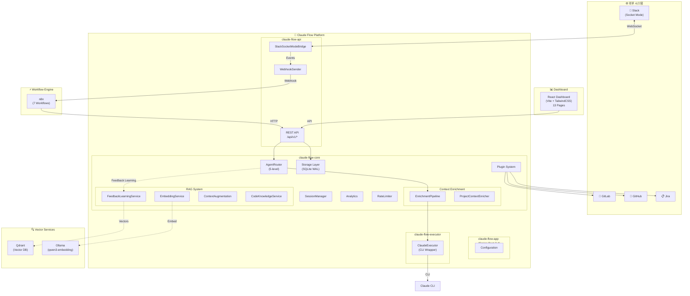
```mermaid
flowchart TB
    subgraph External["🌐 외부 시스템"]
        Slack["💬 Slack<br/>(Socket Mode)"]
        GitLab["🦊 GitLab"]
        GitHub["🐙 GitHub"]
        Jira["📋 Jira"]
    end

    subgraph ClaudeFlow["🤖 Claude Flow Platform"]
        subgraph App["claude-flow-app<br/>(Spring Boot 3.4)"]
            Config["Configuration"]
        end

        subgraph API["claude-flow-api"]
            REST["REST API<br/>/api/v1/*"]
            SlackBridge["SlackSocketModeBridge"]
            WebhookSender["WebhookSender"]
        end

        subgraph Core["claude-flow-core"]
            Router["AgentRouter<br/>(5-level)"]
            Storage["Storage Layer<br/>(SQLite WAL)"]
            Plugin["Plugin System"]
            Session["SessionManager"]
            Analytics["Analytics"]
            RateLimit["RateLimiter"]

            subgraph RAG["RAG System"]
                Embedding["EmbeddingService"]
                Feedback["FeedbackLearningService"]
                Context["ContextAugmentation"]
                CodeKnowledge["CodeKnowledgeService"]
            end

            subgraph Enrichment["Context Enrichment"]
                Pipeline["EnrichmentPipeline"]
                ProjectCtx["ProjectContextEnricher"]
            end
        end

        subgraph Executor["claude-flow-executor"]
            Claude["ClaudeExecutor<br/>(CLI Wrapper)"]
        end
    end

    subgraph Workflow["⚡ Workflow Engine"]
        n8n["n8n<br/>(7 Workflows)"]
    end

    subgraph Dashboard["📊 Dashboard"]
        React["React Dashboard<br/>(Vite + TailwindCSS)<br/>13 Pages"]
    end

    subgraph VectorDB["🔍 Vector Services"]
        Qdrant["Qdrant<br/>(Vector DB)"]
        Ollama["Ollama<br/>(qwen3-embedding)"]
    end

    Slack <-->|WebSocket| SlackBridge
    SlackBridge -->|Events| WebhookSender
    WebhookSender -->|Webhook| n8n
    n8n -->|HTTP| REST
    REST --> Router
    Router --> Pipeline
    Pipeline --> Claude
    Claude -->|CLI| ClaudeCLI["Claude CLI"]
    REST --> Storage
    Plugin --> GitLab
    Plugin --> GitHub
    Plugin --> Jira
    React -->|API| REST
    Router -.->|Feedback Learning| Feedback
    Feedback -.->|Vectors| Qdrant
    Embedding -.->|Embed| Ollama
```

## 2. 모듈 의존성

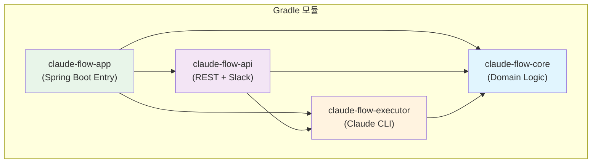
```mermaid
graph TD
    subgraph Modules["Gradle 모듈"]
        APP["claude-flow-app<br/>(Spring Boot Entry)"]
        API["claude-flow-api<br/>(REST + Slack)"]
        EXEC["claude-flow-executor<br/>(Claude CLI)"]
        CORE["claude-flow-core<br/>(Domain Logic)"]
    end

    APP --> API
    APP --> CORE
    APP --> EXEC
    API --> CORE
    API --> EXEC
    EXEC --> CORE

    style CORE fill:#e1f5fe
    style EXEC fill:#fff3e0
    style API fill:#f3e5f5
    style APP fill:#e8f5e9
```

## 3. 메시지 처리 흐름

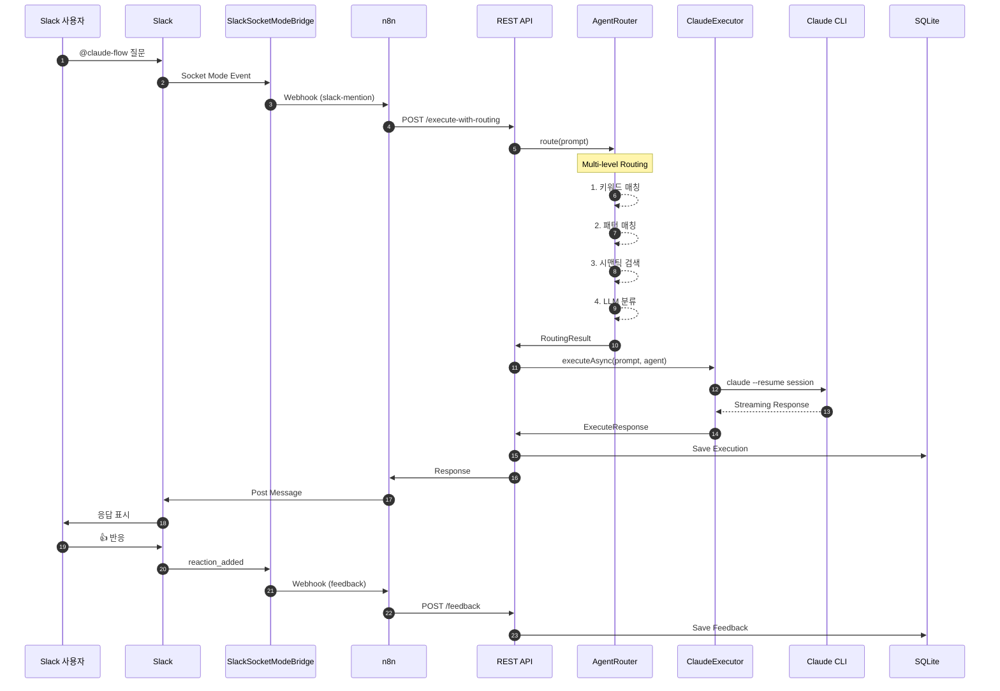
```mermaid
sequenceDiagram
    autonumber
    participant U as Slack 사용자
    participant S as Slack
    participant B as SlackSocketModeBridge
    participant N as n8n
    participant A as REST API
    participant R as AgentRouter
    participant E as ClaudeExecutor
    participant C as Claude CLI
    participant DB as SQLite

    U->>S: @claude-flow 질문
    S->>B: Socket Mode Event
    B->>N: Webhook (slack-mention)

    N->>A: POST /execute-with-routing
    A->>R: route(prompt)

    Note over R: Multi-level Routing
    R-->>R: 1. 키워드 매칭
    R-->>R: 2. 패턴 매칭
    R-->>R: 3. 시맨틱 검색
    R-->>R: 4. LLM 분류

    R->>A: RoutingResult
    A->>E: executeAsync(prompt, agent)
    E->>C: claude --resume session
    C-->>E: Streaming Response
    E->>A: ExecuteResponse

    A->>DB: Save Execution
    A->>N: Response
    N->>S: Post Message
    S->>U: 응답 표시

    U->>S: 👍 반응
    S->>B: reaction_added
    B->>N: Webhook (feedback)
    N->>A: POST /feedback
    A->>DB: Save Feedback
```

## 4. 에이전트 라우팅 파이프라인

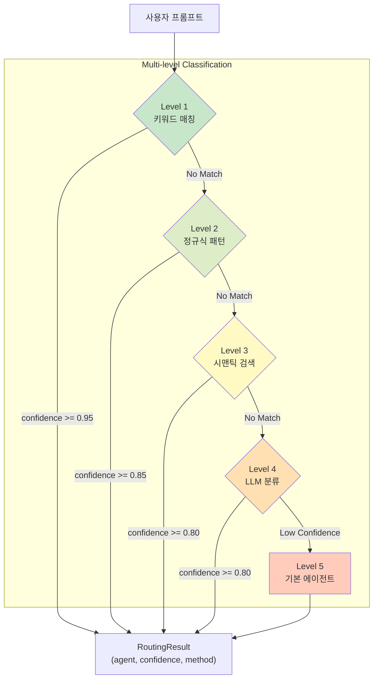
```mermaid
flowchart TD
    Input["사용자 프롬프트"] --> L1

    subgraph Pipeline["Multi-level Classification"]
        L1{"Level 1<br/>키워드 매칭"}
        L2{"Level 2<br/>정규식 패턴"}
        L3{"Level 3<br/>시맨틱 검색"}
        L4{"Level 4<br/>LLM 분류"}
        L5["Level 5<br/>기본 에이전트"]
    end

    L1 -->|"confidence >= 0.95"| Result
    L1 -->|"No Match"| L2
    L2 -->|"confidence >= 0.85"| Result
    L2 -->|"No Match"| L3
    L3 -->|"confidence >= 0.80"| Result
    L3 -->|"No Match"| L4
    L4 -->|"confidence >= 0.80"| Result
    L4 -->|"Low Confidence"| L5
    L5 --> Result

    Result["RoutingResult<br/>(agent, confidence, method)"]

    style L1 fill:#c8e6c9
    style L2 fill:#dcedc8
    style L3 fill:#fff9c4
    style L4 fill:#ffe0b2
    style L5 fill:#ffccbc
```

## 5. 내장 에이전트

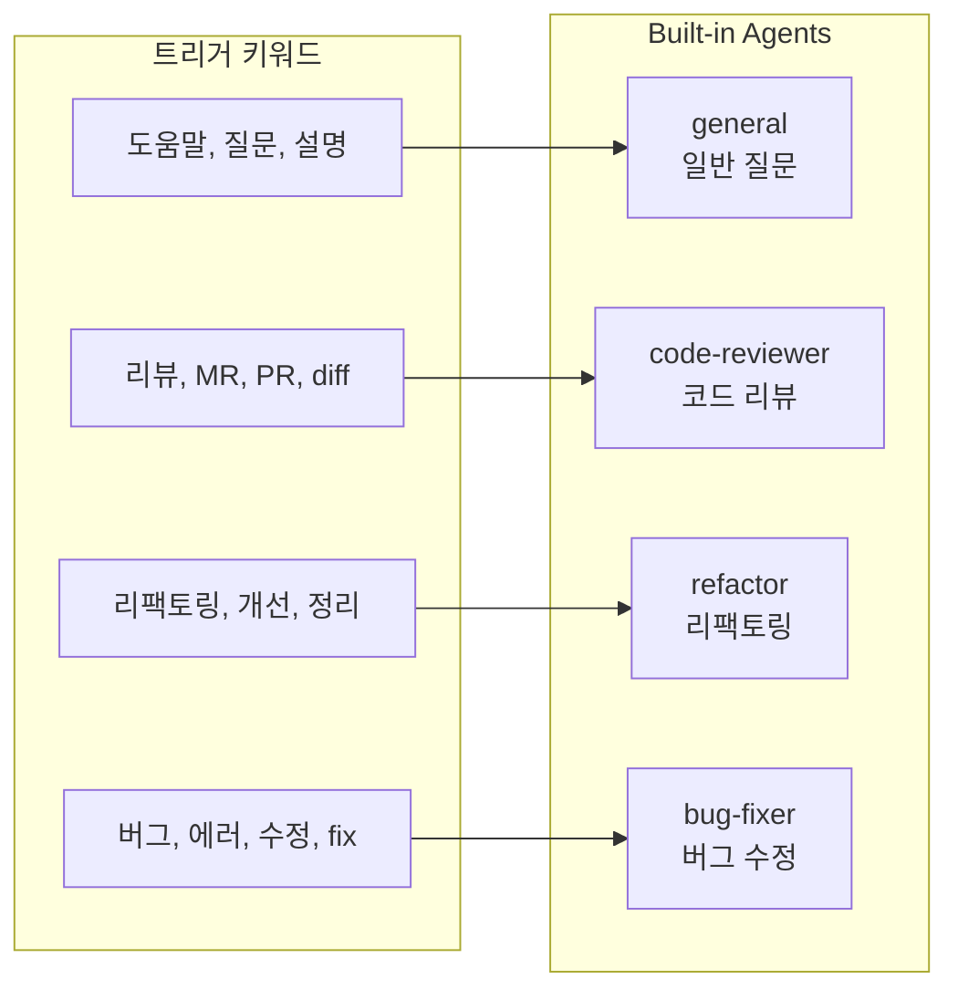
```mermaid
graph LR
    subgraph Agents["Built-in Agents"]
        G["general<br/>일반 질문"]
        CR["code-reviewer<br/>코드 리뷰"]
        RF["refactor<br/>리팩토링"]
        BF["bug-fixer<br/>버그 수정"]
    end

    subgraph Keywords["트리거 키워드"]
        K1["도움말, 질문, 설명"]
        K2["리뷰, MR, PR, diff"]
        K3["리팩토링, 개선, 정리"]
        K4["버그, 에러, 수정, fix"]
    end

    K1 --> G
    K2 --> CR
    K3 --> RF
    K4 --> BF
```

## 6. 스토리지 계층

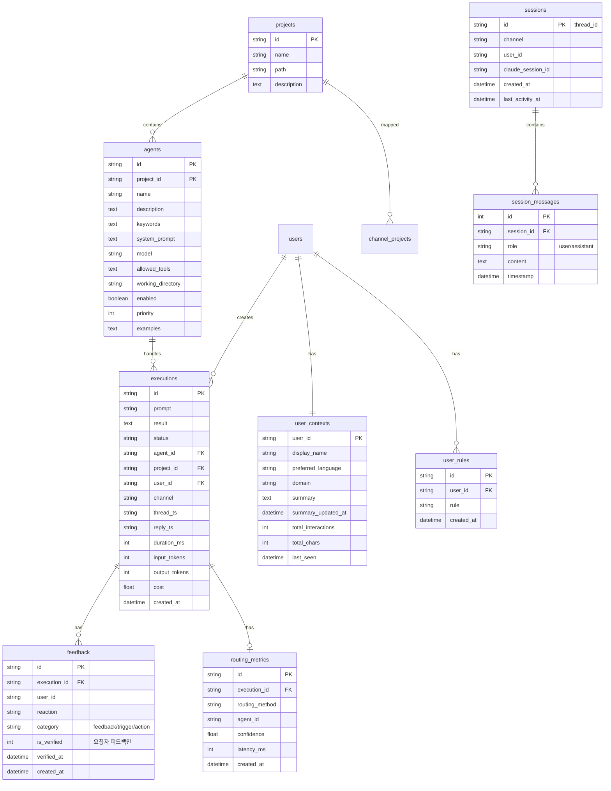
```mermaid
erDiagram
    executions ||--o{ feedback : has
    executions ||--o| routing_metrics : has
    users ||--o{ executions : creates
    users ||--|| user_contexts : has
    users ||--o{ user_rules : has
    agents ||--o{ executions : handles
    projects ||--o{ agents : contains
    projects ||--o{ channel_projects : mapped
    sessions ||--o{ session_messages : contains

    executions {
        string id PK
        string prompt
        text result
        string status
        string agent_id FK
        string project_id FK
        string user_id FK
        string channel
        string thread_ts
        string reply_ts
        int duration_ms
        int input_tokens
        int output_tokens
        float cost
        datetime created_at
    }

    feedback {
        string id PK
        string execution_id FK
        string user_id
        string reaction
        string category "feedback/trigger/action"
        int is_verified "요청자 피드백만"
        datetime verified_at
        datetime created_at
    }

    user_contexts {
        string user_id PK
        string display_name
        string preferred_language
        string domain
        text summary
        datetime summary_updated_at
        int total_interactions
        int total_chars
        datetime last_seen
    }

    user_rules {
        string id PK
        string user_id FK
        string rule
        datetime created_at
    }

    agents {
        string id PK
        string project_id PK
        string name
        text description
        text keywords
        text system_prompt
        string model
        text allowed_tools
        string working_directory
        boolean enabled
        int priority
        text examples
    }

    routing_metrics {
        string id PK
        string execution_id FK
        string routing_method
        string agent_id
        float confidence
        int latency_ms
        datetime created_at
    }

    projects {
        string id PK
        string name
        string path
        text description
    }

    sessions {
        string id PK "thread_id"
        string channel
        string user_id
        string claude_session_id
        datetime created_at
        datetime last_activity_at
    }

    session_messages {
        int id PK
        string session_id FK
        string role "user/assistant"
        text content
        datetime timestamp
    }
```

## 7. 플러그인 시스템

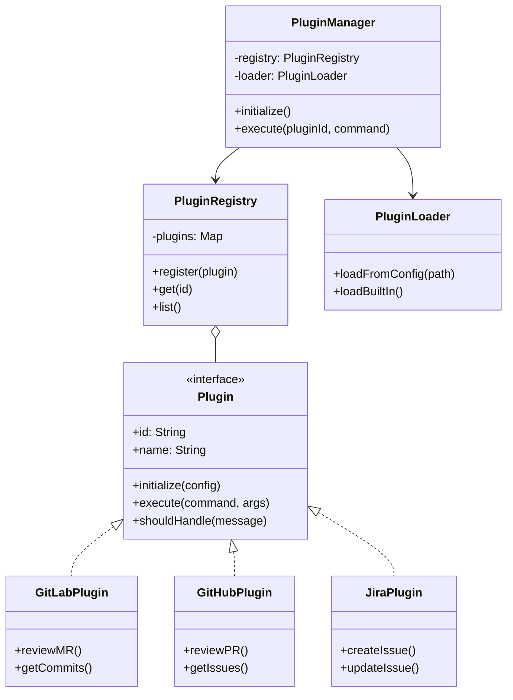
```mermaid
classDiagram
    class Plugin {
        <<interface>>
        +id: String
        +name: String
        +initialize(config)
        +execute(command, args)
        +shouldHandle(message)
    }

    class PluginRegistry {
        -plugins: Map
        +register(plugin)
        +get(id)
        +list()
    }

    class PluginLoader {
        +loadFromConfig(path)
        +loadBuiltIn()
    }

    class PluginManager {
        -registry: PluginRegistry
        -loader: PluginLoader
        +initialize()
        +execute(pluginId, command)
    }

    class GitLabPlugin {
        +reviewMR()
        +getCommits()
    }

    class GitHubPlugin {
        +reviewPR()
        +getIssues()
    }

    class JiraPlugin {
        +createIssue()
        +updateIssue()
    }

    Plugin <|.. GitLabPlugin
    Plugin <|.. GitHubPlugin
    Plugin <|.. JiraPlugin
    PluginRegistry o-- Plugin
    PluginManager --> PluginRegistry
    PluginManager --> PluginLoader
```

## 8. n8n 워크플로우

### 8.0. 이벤트 라우팅 모드

Claude Flow는 두 가지 이벤트 라우팅 모드를 지원합니다:

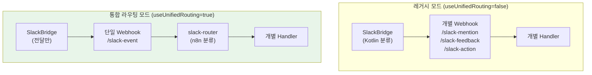
```mermaid
flowchart TB
    subgraph Legacy["레거시 모드 (useUnifiedRouting=false)"]
        direction LR
        L1["SlackBridge<br/>(Kotlin 분류)"] --> L2["개별 Webhook<br/>/slack-mention<br/>/slack-feedback<br/>/slack-action"]
        L2 --> L3["개별 Handler"]
    end

    subgraph Unified["통합 라우팅 모드 (useUnifiedRouting=true)"]
        direction LR
        U1["SlackBridge<br/>(전달만)"] --> U2["단일 Webhook<br/>/slack-event"]
        U2 --> U3["slack-router<br/>(n8n 분류)"]
        U3 --> U4["개별 Handler"]
    end

    style Unified fill:#e8f5e9
```

**통합 라우팅 모드의 장점:**
- n8n UI에서 분류 로직 즉시 수정 가능
- Kotlin 코드 변경 없이 새 이벤트 타입 추가
- 시각적 디버깅

### 8.0.1. slack-router 중앙 분류기

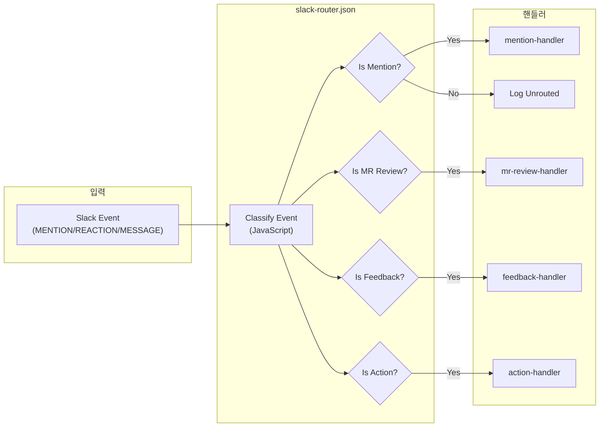
```mermaid
flowchart LR
    subgraph Input["입력"]
        Event["Slack Event<br/>(MENTION/REACTION/MESSAGE)"]
    end

    subgraph Router["slack-router.json"]
        Classify["Classify Event<br/>(JavaScript)"]
        Check1{"Is Mention?"}
        Check2{"Is MR Review?"}
        Check3{"Is Feedback?"}
        Check4{"Is Action?"}
    end

    subgraph Handlers["핸들러"]
        H1["mention-handler"]
        H2["mr-review-handler"]
        H3["feedback-handler"]
        H4["action-handler"]
        H5["Log Unrouted"]
    end

    Event --> Classify
    Classify --> Check1 & Check2 & Check3 & Check4
    Check1 -->|Yes| H1
    Check2 -->|Yes| H2
    Check3 -->|Yes| H3
    Check4 -->|Yes| H4
    Check1 -->|No| H5
```

### 8.0.2. 워크플로우 목록

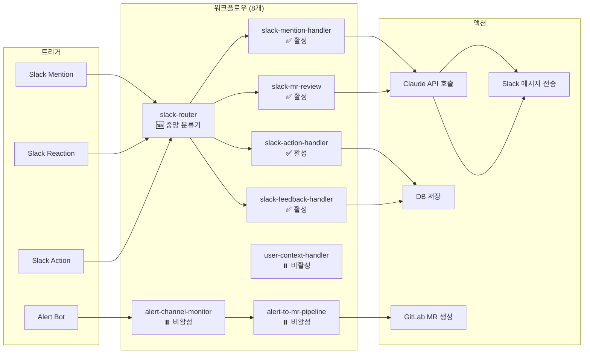
```mermaid
flowchart LR
    subgraph Triggers["트리거"]
        W1["Slack Mention"]
        W2["Slack Reaction"]
        W3["Slack Action"]
        W4["Alert Bot"]
    end

    subgraph Workflows["워크플로우 (8개)"]
        WF0["slack-router<br/>🆕 중앙 분류기"]
        WF1["slack-mention-handler<br/>✅ 활성"]
        WF2["slack-mr-review<br/>✅ 활성"]
        WF3["slack-action-handler<br/>✅ 활성"]
        WF4["slack-feedback-handler<br/>✅ 활성"]
        WF5["user-context-handler<br/>⏸️ 비활성"]
        WF6["alert-channel-monitor<br/>⏸️ 비활성"]
        WF7["alert-to-mr-pipeline<br/>⏸️ 비활성"]
    end

    subgraph Actions["액션"]
        A1["Claude API 호출"]
        A2["Slack 메시지 전송"]
        A3["DB 저장"]
        A4["GitLab MR 생성"]
    end

    W1 --> WF0
    W2 --> WF0
    W3 --> WF0
    WF0 --> WF1
    WF0 --> WF2
    WF0 --> WF3
    WF0 --> WF4
    W4 --> WF6

    WF1 --> A1 --> A2
    WF2 --> A1 --> A2
    WF3 --> A3
    WF4 --> A3
    WF6 --> WF7 --> A4
```

## 8.1. 피드백 루프

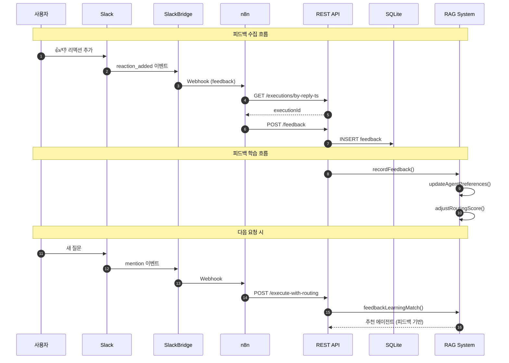
```mermaid
sequenceDiagram
    autonumber
    participant U as 사용자
    participant S as Slack
    participant B as SlackBridge
    participant N as n8n
    participant API as REST API
    participant DB as SQLite
    participant RAG as RAG System

    Note over U,RAG: 피드백 수집 흐름
    U->>S: 👍/👎 리액션 추가
    S->>B: reaction_added 이벤트
    B->>N: Webhook (feedback)
    N->>API: GET /executions/by-reply-ts
    API-->>N: executionId
    N->>API: POST /feedback
    API->>DB: INSERT feedback

    Note over U,RAG: 피드백 학습 흐름
    API->>RAG: recordFeedback()
    RAG->>RAG: updateAgentPreferences()
    RAG->>RAG: adjustRoutingScore()

    Note over U,RAG: 다음 요청 시
    U->>S: 새 질문
    S->>B: mention 이벤트
    B->>N: Webhook
    N->>API: POST /execute-with-routing
    API->>RAG: feedbackLearningMatch()
    RAG-->>API: 추천 에이전트 (피드백 기반)
```

## 8.2. RAG 시스템 아키텍처

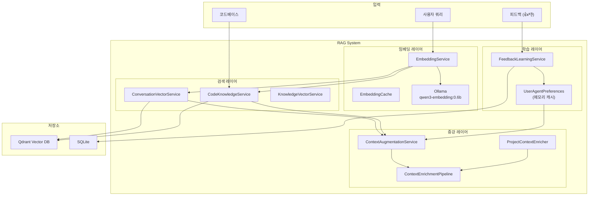
```mermaid
flowchart TB
    subgraph Input["입력"]
        Query["사용자 쿼리"]
        Feedback["피드백 (👍/👎)"]
        Code["코드베이스"]
    end

    subgraph RAG["RAG System"]
        subgraph Embedding["임베딩 레이어"]
            ES["EmbeddingService"]
            EC["EmbeddingCache"]
            Ollama["Ollama<br/>qwen3-embedding:0.6b"]
        end

        subgraph Learning["학습 레이어"]
            FLS["FeedbackLearningService"]
            Prefs["UserAgentPreferences<br/>(메모리 캐시)"]
        end

        subgraph Search["검색 레이어"]
            CVS["ConversationVectorService"]
            CKS["CodeKnowledgeService"]
            KVS["KnowledgeVectorService"]
        end

        subgraph Augmentation["증강 레이어"]
            CAS["ContextAugmentationService"]
            CEP["ContextEnrichmentPipeline"]
            PCE["ProjectContextEnricher"]
        end
    end

    subgraph Storage["저장소"]
        Qdrant["Qdrant Vector DB"]
        SQLite["SQLite"]
    end

    Query --> ES --> Ollama
    ES --> CVS --> Qdrant
    ES --> CKS --> Qdrant
    Feedback --> FLS --> Prefs
    Code --> CKS

    CVS --> CAS
    CKS --> CAS
    Prefs --> CAS
    CAS --> CEP
    PCE --> CEP

    FLS --> SQLite
```

## 8.3. Context Enrichment Pipeline

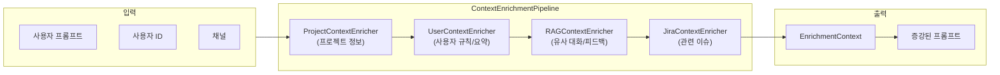
```mermaid
flowchart LR
    subgraph Input["입력"]
        Prompt["사용자 프롬프트"]
        User["사용자 ID"]
        Channel["채널"]
    end

    subgraph Pipeline["ContextEnrichmentPipeline"]
        direction TB
        E1["ProjectContextEnricher<br/>(프로젝트 정보)"]
        E2["UserContextEnricher<br/>(사용자 규칙/요약)"]
        E3["RAGContextEnricher<br/>(유사 대화/피드백)"]
        E4["JiraContextEnricher<br/>(관련 이슈)"]
    end

    subgraph Output["출력"]
        Context["EnrichmentContext"]
        Final["증강된 프롬프트"]
    end

    Input --> E1
    E1 --> E2
    E2 --> E3
    E3 --> E4
    E4 --> Context --> Final
```

### 8.4. Enrichment API

n8n 워크플로우에서 프롬프트 실행 전에 컨텍스트를 주입할 수 있습니다:

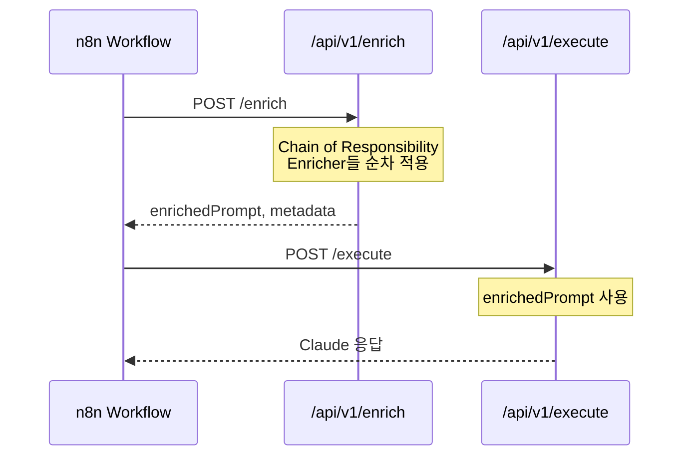
```mermaid
sequenceDiagram
    participant N as n8n Workflow
    participant E as /api/v1/enrich
    participant X as /api/v1/execute

    N->>E: POST /enrich
    Note over E: Chain of Responsibility<br/>Enricher들 순차 적용
    E-->>N: enrichedPrompt, metadata

    N->>X: POST /execute
    Note over X: enrichedPrompt 사용
    X-->>N: Claude 응답
```

**API 스펙:**
```
POST /api/v1/enrich
{
  "prompt": "사용자 메시지",
  "userId": "U123",
  "projectId": "my-project",
  "includeRag": true
}

Response:
{
  "success": true,
  "enrichedPrompt": "컨텍스트가 주입된 프롬프트",
  "appliedEnrichers": ["ProjectContextEnricher", "UserRuleEnricher"],
  "workingDirectory": "/workspace/my-project",
  "ragSystemPrompt": "RAG 시스템 프롬프트 (별도 사용)",
  "processingTimeMs": 45
}
```

**보조 API:**
- `GET /api/v1/enrichers`: 등록된 Enricher 목록 조회
- `GET /api/v1/enrich/rag-status`: RAG 시스템 상태 확인

## 9. Rate Limiting

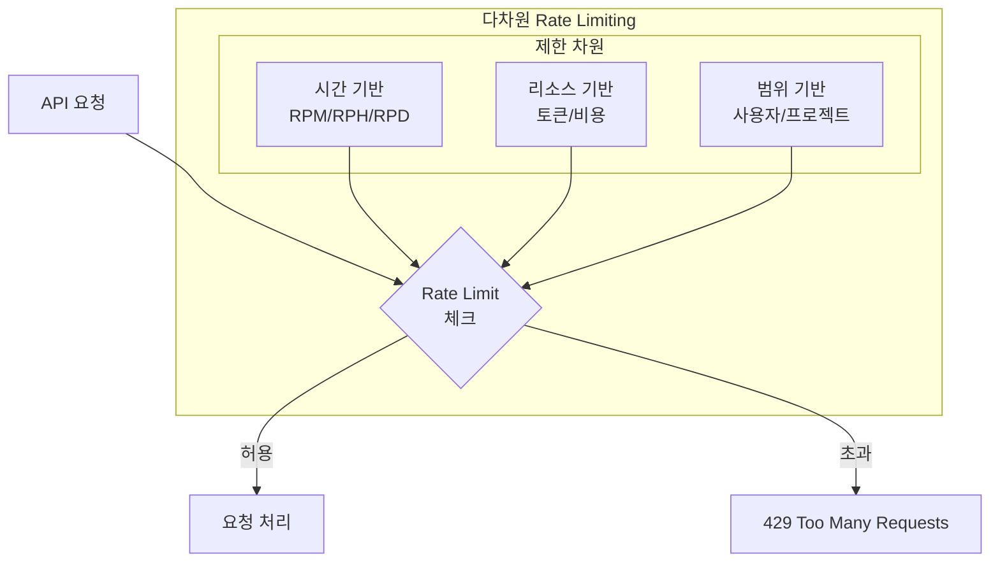
```mermaid
flowchart TD
    Request["API 요청"] --> Check

    subgraph RateLimiter["다차원 Rate Limiting"]
        Check{"Rate Limit<br/>체크"}

        subgraph Dimensions["제한 차원"]
            Time["시간 기반<br/>RPM/RPH/RPD"]
            Resource["리소스 기반<br/>토큰/비용"]
            Scope["범위 기반<br/>사용자/프로젝트"]
        end
    end

    Check -->|허용| Process["요청 처리"]
    Check -->|초과| Reject["429 Too Many Requests"]

    Time --> Check
    Resource --> Check
    Scope --> Check
```

## 10. 세션 관리

### 10.1. 세션 상태 다이어그램

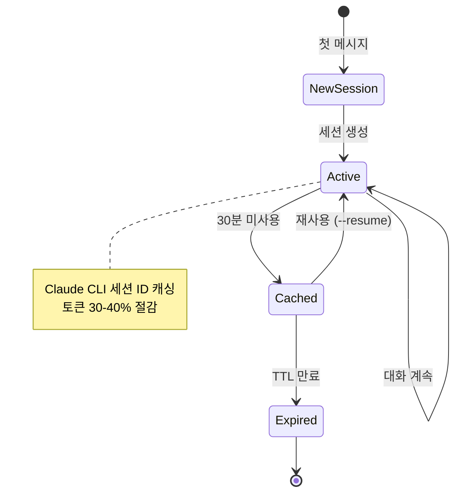
```mermaid
stateDiagram-v2
    [*] --> NewSession: 첫 메시지
    NewSession --> Active: 세션 생성
    Active --> Active: 대화 계속
    Active --> Cached: 30분 미사용
    Cached --> Active: 재사용 (--resume)
    Cached --> Expired: TTL 만료
    Expired --> [*]

    note right of Active
        Claude CLI 세션 ID 캐싱
        토큰 30-40% 절감
    end note
```

### 10.2. 세션 영속화 (하이브리드 방식)

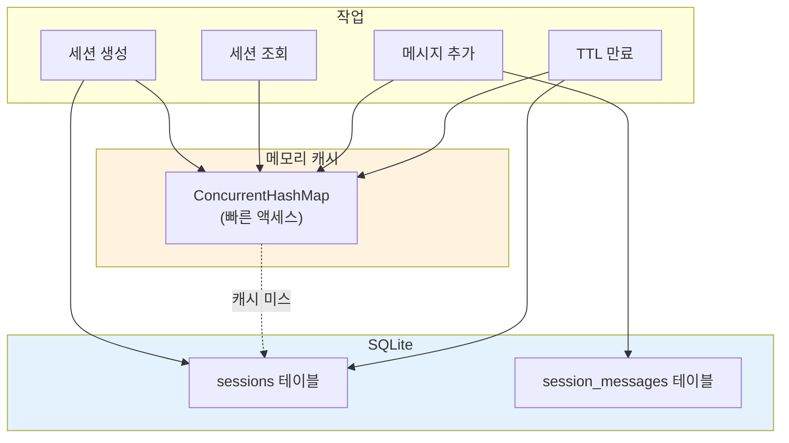
```mermaid
flowchart TB
    subgraph Memory["메모리 캐시"]
        Cache["ConcurrentHashMap<br/>(빠른 액세스)"]
    end

    subgraph Database["SQLite"]
        Sessions["sessions 테이블"]
        Messages["session_messages 테이블"]
    end

    subgraph Operations["작업"]
        Create["세션 생성"] --> Cache & Sessions
        Read["세션 조회"] --> Cache
        Cache -.->|캐시 미스| Sessions
        Update["메시지 추가"] --> Cache & Messages
        Cleanup["TTL 만료"] --> Cache & Sessions
    end

    style Memory fill:#fff3e0
    style Database fill:#e3f2fd
```

**특징:**
- **앱 재시작 시 복구**: 활성 세션이 DB에서 자동 로드
- **하이브리드 캐싱**: 메모리 캐시로 빠른 액세스, DB로 영속화
- **자동 정리**: TTL 만료 세션 자동 삭제

**테이블 구조:**
```sql
-- 세션 테이블
CREATE TABLE sessions (
    id TEXT PRIMARY KEY,        -- Slack thread ID
    channel TEXT NOT NULL,
    user_id TEXT NOT NULL,
    claude_session_id TEXT,     -- Claude CLI 세션 ID
    created_at TIMESTAMP,
    last_activity_at TIMESTAMP
);

-- 세션 메시지 테이블
CREATE TABLE session_messages (
    id INTEGER PRIMARY KEY AUTOINCREMENT,
    session_id TEXT NOT NULL,
    role TEXT NOT NULL,         -- 'user' or 'assistant'
    content TEXT NOT NULL,
    timestamp TIMESTAMP,
    FOREIGN KEY(session_id) REFERENCES sessions(id)
);
```

## 11. 배포 아키텍처

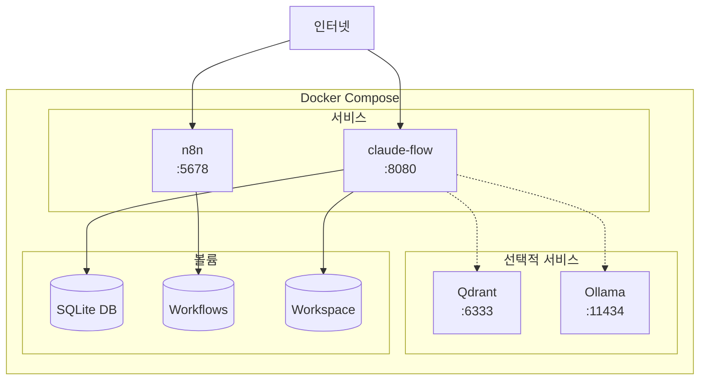
```mermaid
flowchart TB
    subgraph Docker["Docker Compose"]
        subgraph Services["서비스"]
            CF["claude-flow<br/>:8080"]
            N8N["n8n<br/>:5678"]
        end

        subgraph Optional["선택적 서비스"]
            QD["Qdrant<br/>:6333"]
            OL["Ollama<br/>:11434"]
        end

        subgraph Volumes["볼륨"]
            DB[(SQLite DB)]
            WF[(Workflows)]
            WS[(Workspace)]
        end
    end

    CF --> DB
    CF --> WS
    N8N --> WF
    CF -.-> QD
    CF -.-> OL

    Internet["인터넷"] --> CF
    Internet --> N8N
```

## 12. 대시보드 구조

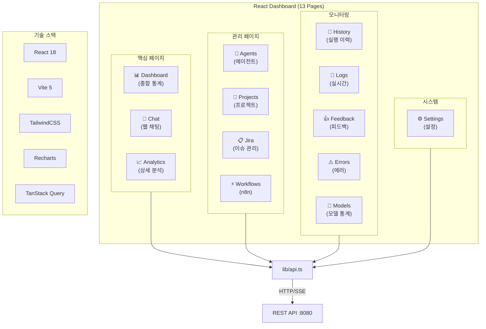
```mermaid
flowchart TD
    subgraph Dashboard["React Dashboard (13 Pages)"]
        subgraph Core["핵심 페이지"]
            P1["📊 Dashboard<br/>(종합 통계)"]
            P2["💬 Chat<br/>(웹 채팅)"]
            P3["📈 Analytics<br/>(상세 분석)"]
        end

        subgraph Management["관리 페이지"]
            P4["🤖 Agents<br/>(에이전트)"]
            P5["📁 Projects<br/>(프로젝트)"]
            P6["📋 Jira<br/>(이슈 관리)"]
            P7["⚡ Workflows<br/>(n8n)"]
        end

        subgraph Monitoring["모니터링"]
            P8["📜 History<br/>(실행 이력)"]
            P9["📝 Logs<br/>(실시간)"]
            P10["👍 Feedback<br/>(피드백)"]
            P11["⚠️ Errors<br/>(에러)"]
            P12["🧠 Models<br/>(모델 통계)"]
        end

        subgraph System["시스템"]
            P13["⚙️ Settings<br/>(설정)"]
        end
    end

    subgraph Tech["기술 스택"]
        React["React 18"]
        Vite["Vite 5"]
        TW["TailwindCSS"]
        RC["Recharts"]
        RQ["TanStack Query"]
    end

    Core --> API["lib/api.ts"]
    Management --> API
    Monitoring --> API
    System --> API
    API -->|HTTP/SSE| Backend["REST API :8080"]
```

## 13. 전체 기술 스택

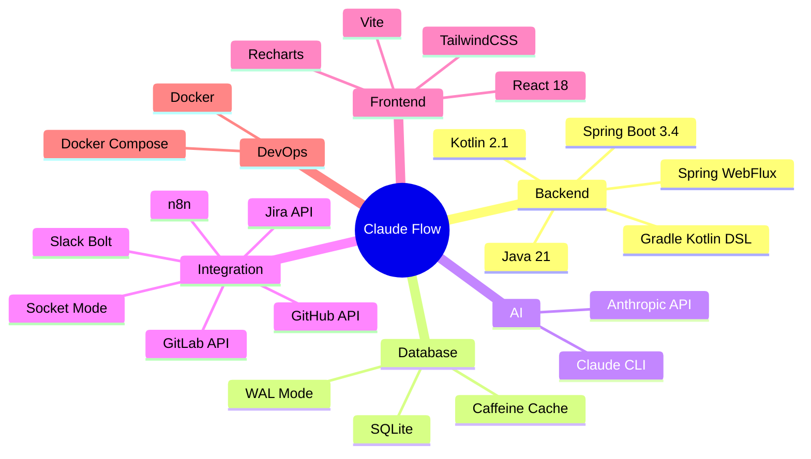
```mermaid
mindmap
    root((Claude Flow))
        Backend
            Kotlin 2.1
            Java 21
            Spring Boot 3.4
            Spring WebFlux
            Gradle Kotlin DSL
        Database
            SQLite
            WAL Mode
            Caffeine Cache
        AI
            Claude CLI
            Anthropic API
        Integration
            Slack Bolt
            Socket Mode
            n8n
            GitLab API
            GitHub API
            Jira API
        Frontend
            React 18
            Vite
            TailwindCSS
            Recharts
        DevOps
            Docker
            Docker Compose
```

## 요약

Claude Flow는 **4개의 핵심 모듈**로 구성된 AI 에이전트 플랫폼입니다:

| 모듈 | 역할 | 핵심 컴포넌트 |
|------|------|--------------|
| **claude-flow-core** | 도메인 로직 | AgentRouter, Storage, Plugin, RAG, Enrichment, SessionManager |
| **claude-flow-executor** | CLI 래퍼 | ClaudeExecutor (세션 관리, 스트리밍) |
| **claude-flow-api** | API 레이어 | REST API, SlackSocketModeBridge, EnrichmentController |
| **claude-flow-app** | 애플리케이션 | Spring Boot 통합, 설정 |

**핵심 특징**:
- 5단계 멀티레벨 라우팅 (피드백 학습 → 키워드 → 패턴 → 시맨틱 → 폴백)
- Claude 세션 캐싱으로 토큰 30-40% 절감 (DB 영속화 지원)
- n8n 기반 8개 워크플로우 (slack-router 중앙 분류기 포함)
- 통합 라우팅 모드: n8n에서 이벤트 분류, Kotlin은 전달만
- 실시간 P50/P90/P95/P99 분석
- 플러그인 시스템 (GitLab, GitHub, Jira, n8n)
- RAG 시스템 (Qdrant + Ollama)
  - 피드백 학습 기반 에이전트 추천
  - 컨텍스트 증강 파이프라인 (Enrichment API 공개)
  - 코드베이스 인덱싱
- 13개 대시보드 페이지 (Chat, Analytics, Jira, Workflows 등)

**데이터 흐름 (통합 라우팅 모드)**:
```
Slack → SlackBridge → n8n(slack-router) → [분류] → Handler → REST API → AgentRouter → ContextEnrichment → ClaudeExecutor
                                                                                              ↓
                                                                                        RAG System (피드백 학습, 유사 대화 검색)
```

**주요 API**:
- `POST /api/v1/execute`: Claude 실행
- `POST /api/v1/execute-with-routing`: 라우팅 포함 실행
- `POST /api/v1/enrich`: 컨텍스트 증강
- `POST /api/v1/feedback`: 피드백 저장
- `GET /api/v1/sessions`: 세션 관리
