# Claude Flow Architecture

이 문서는 Claude Flow 프로젝트의 전체 아키텍처를 설명합니다.

> **Last Updated**: 2025-12-22

## 1. 시스템 전체 구조


## 2. 모듈 의존성


## 3. 메시지 처리 흐름

```mermaid
sequenceDiagram
    autonumber
    participant U as Slack 사용자
    participant S as Slack
    participant B as SlackSocketModeBridge
    participant N as n8n
    participant A as REST API
    participant R as AgentRouter
    participant E as ClaudeExecutor
    participant C as Claude CLI
    participant DB as SQLite

    U->>S: @claude-flow 질문
    S->>B: Socket Mode Event
    B->>N: Webhook (slack-mention)

    N->>A: POST /execute-with-routing
    A->>R: route(prompt)

    Note over R: Multi-level Routing
    R-->>R: 1. 키워드 매칭
    R-->>R: 2. 패턴 매칭
    R-->>R: 3. 시맨틱 검색
    R-->>R: 4. LLM 분류

    R->>A: RoutingResult
    A->>E: executeAsync(prompt, agent)
    E->>C: claude --resume session
    C-->>E: Streaming Response
    E->>A: ExecuteResponse

    A->>DB: Save Execution
    A->>N: Response
    N->>S: Post Message
    S->>U: 응답 표시

    U->>S: 👍 반응
    S->>B: reaction_added
    B->>N: Webhook (feedback)
    N->>A: POST /feedback
    A->>DB: Save Feedback
```

## 4. 에이전트 라우팅 파이프라인

```mermaid
flowchart TD
    Input["사용자 프롬프트"] --> L1

    subgraph Pipeline["Multi-level Classification"]
        L1{"Level 1<br/>키워드 매칭"}
        L2{"Level 2<br/>정규식 패턴"}
        L3{"Level 3<br/>시맨틱 검색"}
        L4{"Level 4<br/>LLM 분류"}
        L5["Level 5<br/>기본 에이전트"]
    end

    L1 -->|"confidence >= 0.95"| Result
    L1 -->|"No Match"| L2
    L2 -->|"confidence >= 0.85"| Result
    L2 -->|"No Match"| L3
    L3 -->|"confidence >= 0.80"| Result
    L3 -->|"No Match"| L4
    L4 -->|"confidence >= 0.80"| Result
    L4 -->|"Low Confidence"| L5
    L5 --> Result

    Result["RoutingResult<br/>(agent, confidence, method)"]

    style L1 fill:#c8e6c9
    style L2 fill:#dcedc8
    style L3 fill:#fff9c4
    style L4 fill:#ffe0b2
    style L5 fill:#ffccbc
```

## 5. 내장 에이전트

```mermaid
graph LR
    subgraph Agents["Built-in Agents"]
        G["general<br/>일반 질문"]
        CR["code-reviewer<br/>코드 리뷰"]
        RF["refactor<br/>리팩토링"]
        BF["bug-fixer<br/>버그 수정"]
    end

    subgraph Keywords["트리거 키워드"]
        K1["도움말, 질문, 설명"]
        K2["리뷰, MR, PR, diff"]
        K3["리팩토링, 개선, 정리"]
        K4["버그, 에러, 수정, fix"]
    end

    K1 --> G
    K2 --> CR
    K3 --> RF
    K4 --> BF
```

## 6. 스토리지 계층

```mermaid
erDiagram
    executions ||--o{ feedback : has
    executions ||--o| routing_metrics : has
    users ||--o{ executions : creates
    users ||--|| user_contexts : has
    users ||--o{ user_rules : has
    agents ||--o{ executions : handles
    projects ||--o{ agents : contains
    projects ||--o{ channel_projects : mapped

    executions {
        string id PK
        string prompt
        text result
        string status
        string agent_id FK
        string project_id FK
        string user_id FK
        string channel
        string thread_ts
        string reply_ts
        int duration_ms
        int input_tokens
        int output_tokens
        float cost
        datetime created_at
    }

    feedback {
        string id PK
        string execution_id FK
        string user_id
        string reaction
        string category "feedback/trigger/action"
        int is_verified "요청자 피드백만"
        datetime verified_at
        datetime created_at
    }

    user_contexts {
        string user_id PK
        string display_name
        string preferred_language
        string domain
        text summary
        datetime summary_updated_at
        int total_interactions
        int total_chars
        datetime last_seen
    }

    user_rules {
        string id PK
        string user_id FK
        string rule
        datetime created_at
    }

    agents {
        string id PK
        string project_id PK
        string name
        text description
        text keywords
        text system_prompt
        string model
        text allowed_tools
        string working_directory
        boolean enabled
        int priority
        text examples
    }

    routing_metrics {
        string id PK
        string execution_id FK
        string routing_method
        string agent_id
        float confidence
        int latency_ms
        datetime created_at
    }

    projects {
        string id PK
        string name
        string path
        text description
    }
```

## 7. 플러그인 시스템


## 8. n8n 워크플로우

```mermaid
flowchart LR
    subgraph Triggers["트리거"]
        W1["Slack Mention"]
        W2["Slack Reaction"]
        W3["Slack Action"]
        W4["Alert Bot"]
    end

    subgraph Workflows["워크플로우 (7개)"]
        WF1["slack-mention-handler<br/>✅ 활성"]
        WF2["slack-mr-review<br/>✅ 활성"]
        WF3["slack-action-handler<br/>✅ 활성"]
        WF4["slack-feedback-handler<br/>✅ 활성"]
        WF5["user-context-handler<br/>⏸️ 비활성"]
        WF6["alert-channel-monitor<br/>⏸️ 비활성"]
        WF7["alert-to-mr-pipeline<br/>⏸️ 비활성"]
    end

    subgraph Actions["액션"]
        A1["Claude API 호출"]
        A2["Slack 메시지 전송"]
        A3["DB 저장"]
        A4["GitLab MR 생성"]
    end

    W1 --> WF1
    W1 --> WF2
    W2 --> WF4
    W3 --> WF3
    W4 --> WF6

    WF1 --> A1 --> A2
    WF2 --> A1 --> A2
    WF3 --> A3
    WF4 --> A3
    WF6 --> WF7 --> A4
```

## 8.1. 피드백 루프

```mermaid
sequenceDiagram
    autonumber
    participant U as 사용자
    participant S as Slack
    participant B as SlackBridge
    participant N as n8n
    participant API as REST API
    participant DB as SQLite
    participant RAG as RAG System

    Note over U,RAG: 피드백 수집 흐름
    U->>S: 👍/👎 리액션 추가
    S->>B: reaction_added 이벤트
    B->>N: Webhook (feedback)
    N->>API: GET /executions/by-reply-ts
    API-->>N: executionId
    N->>API: POST /feedback
    API->>DB: INSERT feedback

    Note over U,RAG: 피드백 학습 흐름
    API->>RAG: recordFeedback()
    RAG->>RAG: updateAgentPreferences()
    RAG->>RAG: adjustRoutingScore()

    Note over U,RAG: 다음 요청 시
    U->>S: 새 질문
    S->>B: mention 이벤트
    B->>N: Webhook
    N->>API: POST /execute-with-routing
    API->>RAG: feedbackLearningMatch()
    RAG-->>API: 추천 에이전트 (피드백 기반)
```

## 8.2. RAG 시스템 아키텍처

```mermaid
flowchart TB
    subgraph Input["입력"]
        Query["사용자 쿼리"]
        Feedback["피드백 (👍/👎)"]
        Code["코드베이스"]
    end

    subgraph RAG["RAG System"]
        subgraph Embedding["임베딩 레이어"]
            ES["EmbeddingService"]
            EC["EmbeddingCache"]
            Ollama["Ollama<br/>qwen3-embedding:0.6b"]
        end

        subgraph Learning["학습 레이어"]
            FLS["FeedbackLearningService"]
            Prefs["UserAgentPreferences<br/>(메모리 캐시)"]
        end

        subgraph Search["검색 레이어"]
            CVS["ConversationVectorService"]
            CKS["CodeKnowledgeService"]
            KVS["KnowledgeVectorService"]
        end

        subgraph Augmentation["증강 레이어"]
            CAS["ContextAugmentationService"]
            CEP["ContextEnrichmentPipeline"]
            PCE["ProjectContextEnricher"]
        end
    end

    subgraph Storage["저장소"]
        Qdrant["Qdrant Vector DB"]
        SQLite["SQLite"]
    end

    Query --> ES --> Ollama
    ES --> CVS --> Qdrant
    ES --> CKS --> Qdrant
    Feedback --> FLS --> Prefs
    Code --> CKS

    CVS --> CAS
    CKS --> CAS
    Prefs --> CAS
    CAS --> CEP
    PCE --> CEP

    FLS --> SQLite
```

## 8.3. Context Enrichment Pipeline

```mermaid
flowchart LR
    subgraph Input["입력"]
        Prompt["사용자 프롬프트"]
        User["사용자 ID"]
        Channel["채널"]
    end

    subgraph Pipeline["ContextEnrichmentPipeline"]
        direction TB
        E1["ProjectContextEnricher<br/>(프로젝트 정보)"]
        E2["UserContextEnricher<br/>(사용자 규칙/요약)"]
        E3["RAGContextEnricher<br/>(유사 대화/피드백)"]
        E4["JiraContextEnricher<br/>(관련 이슈)"]
    end

    subgraph Output["출력"]
        Context["EnrichmentContext"]
        Final["증강된 프롬프트"]
    end

    Input --> E1
    E1 --> E2
    E2 --> E3
    E3 --> E4
    E4 --> Context --> Final
```

## 9. Rate Limiting

```mermaid
flowchart TD
    Request["API 요청"] --> Check

    subgraph RateLimiter["다차원 Rate Limiting"]
        Check{"Rate Limit<br/>체크"}

        subgraph Dimensions["제한 차원"]
            Time["시간 기반<br/>RPM/RPH/RPD"]
            Resource["리소스 기반<br/>토큰/비용"]
            Scope["범위 기반<br/>사용자/프로젝트"]
        end
    end

    Check -->|허용| Process["요청 처리"]
    Check -->|초과| Reject["429 Too Many Requests"]

    Time --> Check
    Resource --> Check
    Scope --> Check
```

## 10. 세션 관리

```mermaid
stateDiagram-v2
    [*] --> NewSession: 첫 메시지
    NewSession --> Active: 세션 생성
    Active --> Active: 대화 계속
    Active --> Cached: 30분 미사용
    Cached --> Active: 재사용 (--resume)
    Cached --> Expired: TTL 만료
    Expired --> [*]

    note right of Active
        Claude CLI 세션 ID 캐싱
        토큰 30-40% 절감
    end note
```

## 11. 배포 아키텍처

```mermaid
flowchart TB
    subgraph Docker["Docker Compose"]
        subgraph Services["서비스"]
            CF["claude-flow<br/>:8080"]
            N8N["n8n<br/>:5678"]
        end

        subgraph Optional["선택적 서비스"]
            QD["Qdrant<br/>:6333"]
            OL["Ollama<br/>:11434"]
        end

        subgraph Volumes["볼륨"]
            DB[(SQLite DB)]
            WF[(Workflows)]
            WS[(Workspace)]
        end
    end

    CF --> DB
    CF --> WS
    N8N --> WF
    CF -.-> QD
    CF -.-> OL

    Internet["인터넷"] --> CF
    Internet --> N8N
```

## 12. 대시보드 구조

```mermaid
flowchart TD
    subgraph Dashboard["React Dashboard (13 Pages)"]
        subgraph Core["핵심 페이지"]
            P1["📊 Dashboard<br/>(종합 통계)"]
            P2["💬 Chat<br/>(웹 채팅)"]
            P3["📈 Analytics<br/>(상세 분석)"]
        end

        subgraph Management["관리 페이지"]
            P4["🤖 Agents<br/>(에이전트)"]
            P5["📁 Projects<br/>(프로젝트)"]
            P6["📋 Jira<br/>(이슈 관리)"]
            P7["⚡ Workflows<br/>(n8n)"]
        end

        subgraph Monitoring["모니터링"]
            P8["📜 History<br/>(실행 이력)"]
            P9["📝 Logs<br/>(실시간)"]
            P10["👍 Feedback<br/>(피드백)"]
            P11["⚠️ Errors<br/>(에러)"]
            P12["🧠 Models<br/>(모델 통계)"]
        end

        subgraph System["시스템"]
            P13["⚙️ Settings<br/>(설정)"]
        end
    end

    subgraph Tech["기술 스택"]
        React["React 18"]
        Vite["Vite 5"]
        TW["TailwindCSS"]
        RC["Recharts"]
        RQ["TanStack Query"]
    end

    Core --> API["lib/api.ts"]
    Management --> API
    Monitoring --> API
    System --> API
    API -->|HTTP/SSE| Backend["REST API :8080"]
```

## 13. 전체 기술 스택


## 요약

Claude Flow는 **4개의 핵심 모듈**로 구성된 AI 에이전트 플랫폼입니다:

| 모듈 | 역할 | 핵심 컴포넌트 |
|------|------|--------------|
| **claude-flow-core** | 도메인 로직 | AgentRouter, Storage, Plugin, RAG, Enrichment |
| **claude-flow-executor** | CLI 래퍼 | ClaudeExecutor (세션 관리, 스트리밍) |
| **claude-flow-api** | API 레이어 | REST API, SlackSocketModeBridge, WebhookSender |
| **claude-flow-app** | 애플리케이션 | Spring Boot 통합, 설정 |

**핵심 특징**:
- 5단계 멀티레벨 라우팅 (피드백 학습 → 키워드 → 패턴 → 시맨틱 → 폴백)
- Claude 세션 캐싱으로 토큰 30-40% 절감
- n8n 기반 7개 워크플로우 (Slack 멘션, MR 리뷰, 피드백 수집 등)
- 실시간 P50/P90/P95/P99 분석
- 플러그인 시스템 (GitLab, GitHub, Jira, n8n)
- RAG 시스템 (Qdrant + Ollama)
  - 피드백 학습 기반 에이전트 추천
  - 컨텍스트 증강 파이프라인
  - 코드베이스 인덱싱
- 13개 대시보드 페이지 (Chat, Analytics, Jira, Workflows 등)

**데이터 흐름**:
```
Slack → SlackBridge → n8n → REST API → AgentRouter → ContextEnrichment → ClaudeExecutor → Claude CLI
                                              ↓
                                        RAG System (피드백 학습, 유사 대화 검색)
```
