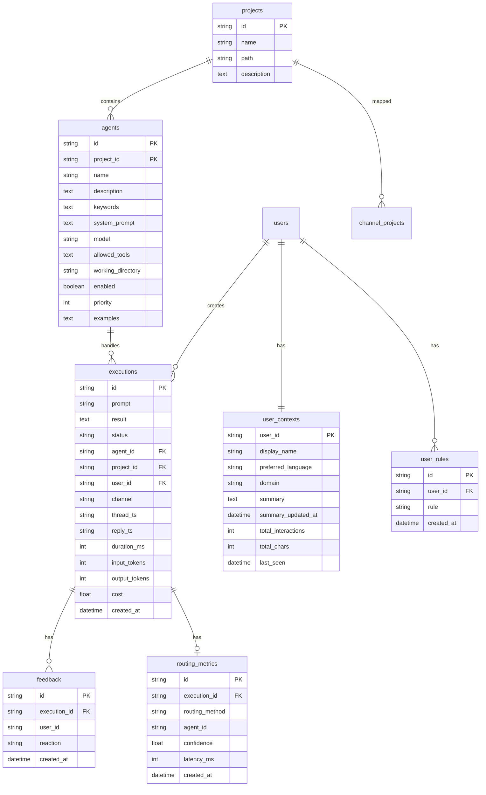

# Claude Flow Architecture

이 문서는 Claude Flow 프로젝트의 전체 아키텍처를 설명합니다.

## 1. 시스템 전체 구조

```mermaid
flowchart TB
    subgraph External["외부 시스템"]
        Slack["Slack<br/>(Socket Mode)"]
        GitLab["GitLab"]
        GitHub["GitHub"]
        Jira["Jira"]
    end

    subgraph ClaudeFlow["Claude Flow Platform"]
        subgraph App["claude-flow-app<br/>(Spring Boot 3.4)"]
            Config["Configuration"]
        end

        subgraph API["claude-flow-api"]
            REST["REST API<br/>/api/v1/*"]
            SlackBridge["SlackSocketModeBridge"]
            WebhookSender["WebhookSender"]
        end

        subgraph Core["claude-flow-core"]
            Router["AgentRouter<br/>(Multi-level)"]
            Storage["Storage Layer<br/>(SQLite WAL)"]
            Plugin["Plugin System"]
            Session["SessionManager"]
            Analytics["Analytics"]
            RateLimit["RateLimiter"]
        end

        subgraph Executor["claude-flow-executor"]
            Claude["ClaudeExecutor<br/>(CLI Wrapper)"]
        end
    end

    subgraph Workflow["Workflow Engine"]
        n8n["n8n<br/>(13 Workflows)"]
    end

    subgraph Dashboard["Dashboard"]
        React["React Dashboard<br/>(Vite + TailwindCSS)"]
    end

    subgraph Optional["Optional Services"]
        Qdrant["Qdrant<br/>(Vector DB)"]
        Ollama["Ollama<br/>(Embeddings)"]
    end

    Slack <-->|WebSocket| SlackBridge
    SlackBridge -->|Events| WebhookSender
    WebhookSender -->|Webhook| n8n
    n8n -->|HTTP| REST
    REST --> Router
    Router --> Claude
    Claude -->|CLI| ClaudeCLI["Claude CLI"]
    REST --> Storage
    Plugin --> GitLab
    Plugin --> GitHub
    Plugin --> Jira
    React -->|API| REST
    Router -.->|Semantic| Qdrant
    Router -.->|Embedding| Ollama
```

## 2. 모듈 의존성

## 3. 메시지 처리 흐름

```mermaid
sequenceDiagram
    autonumber
    participant U as Slack 사용자
    participant S as Slack
    participant B as SlackSocketModeBridge
    participant N as n8n
    participant A as REST API
    participant R as AgentRouter
    participant E as ClaudeExecutor
    participant C as Claude CLI
    participant DB as SQLite

    U->>S: @claude-flow 질문
    S->>B: Socket Mode Event
    B->>N: Webhook (slack-mention)

    N->>A: POST /execute-with-routing
    A->>R: route(prompt)

    Note over R: Multi-level Routing
    R-->>R: 1. 키워드 매칭
    R-->>R: 2. 패턴 매칭
    R-->>R: 3. 시맨틱 검색
    R-->>R: 4. LLM 분류

    R->>A: RoutingResult
    A->>E: executeAsync(prompt, agent)
    E->>C: claude --resume session
    C-->>E: Streaming Response
    E->>A: ExecuteResponse

    A->>DB: Save Execution
    A->>N: Response
    N->>S: Post Message
    S->>U: 응답 표시

    U->>S: 👍 반응
    S->>B: reaction_added
    B->>N: Webhook (feedback)
    N->>A: POST /feedback
    A->>DB: Save Feedback
```

## 4. 에이전트 라우팅 파이프라인

```mermaid
flowchart TD
    Input["사용자 프롬프트"] --> L1

    subgraph Pipeline["Multi-level Classification"]
        L1{"Level 1<br/>키워드 매칭"}
        L2{"Level 2<br/>정규식 패턴"}
        L3{"Level 3<br/>시맨틱 검색"}
        L4{"Level 4<br/>LLM 분류"}
        L5["Level 5<br/>기본 에이전트"]
    end

    L1 -->|"confidence >= 0.95"| Result
    L1 -->|"No Match"| L2
    L2 -->|"confidence >= 0.85"| Result
    L2 -->|"No Match"| L3
    L3 -->|"confidence >= 0.80"| Result
    L3 -->|"No Match"| L4
    L4 -->|"confidence >= 0.80"| Result
    L4 -->|"Low Confidence"| L5
    L5 --> Result

    Result["RoutingResult<br/>(agent, confidence, method)"]

    style L1 fill:#c8e6c9
    style L2 fill:#dcedc8
    style L3 fill:#fff9c4
    style L4 fill:#ffe0b2
    style L5 fill:#ffccbc
```

## 5. 내장 에이전트

```mermaid
graph LR
    subgraph Agents["Built-in Agents"]
        G["general<br/>일반 질문"]
        CR["code-reviewer<br/>코드 리뷰"]
        RF["refactor<br/>리팩토링"]
        BF["bug-fixer<br/>버그 수정"]
    end

    subgraph Keywords["트리거 키워드"]
        K1["도움말, 질문, 설명"]
        K2["리뷰, MR, PR, diff"]
        K3["리팩토링, 개선, 정리"]
        K4["버그, 에러, 수정, fix"]
    end

    K1 --> G
    K2 --> CR
    K3 --> RF
    K4 --> BF
```

## 6. 스토리지 계층

## 7. 플러그인 시스템

## 8. n8n 워크플로우

```mermaid
flowchart LR
    subgraph Triggers["트리거"]
        W1["Slack Mention"]
        W2["Slack Message"]
        W3["GitLab Webhook"]
        W4["Schedule"]
    end

    subgraph Workflows["워크플로우"]
        WF1["slack-mention-handler"]
        WF2["slack-message-handler"]
        WF3["gitlab-mr-review"]
        WF4["daily-report"]
        WF5["user-context-handler"]
        WF6["slack-feedback-handler"]
    end

    subgraph Actions["액션"]
        A1["Claude API 호출"]
        A2["Slack 메시지 전송"]
        A3["DB 저장"]
        A4["알림 전송"]
    end

    W1 --> WF1
    W2 --> WF2
    W3 --> WF3
    W4 --> WF4

    WF1 --> A1
    WF1 --> A2
    WF2 --> A1
    WF3 --> A1
    WF3 --> A2
    WF4 --> A3
    WF4 --> A4
    WF5 --> A3
    WF6 --> A3
```

## 9. Rate Limiting

```mermaid
flowchart TD
    Request["API 요청"] --> Check

    subgraph RateLimiter["다차원 Rate Limiting"]
        Check{"Rate Limit<br/>체크"}

        subgraph Dimensions["제한 차원"]
            Time["시간 기반<br/>RPM/RPH/RPD"]
            Resource["리소스 기반<br/>토큰/비용"]
            Scope["범위 기반<br/>사용자/프로젝트"]
        end
    end

    Check -->|허용| Process["요청 처리"]
    Check -->|초과| Reject["429 Too Many Requests"]

    Time --> Check
    Resource --> Check
    Scope --> Check
```

## 10. 세션 관리

```mermaid
stateDiagram-v2
    [*] --> NewSession: 첫 메시지
    NewSession --> Active: 세션 생성
    Active --> Active: 대화 계속
    Active --> Cached: 30분 미사용
    Cached --> Active: 재사용 (--resume)
    Cached --> Expired: TTL 만료
    Expired --> [*]

    note right of Active
        Claude CLI 세션 ID 캐싱
        토큰 30-40% 절감
    end note
```

## 11. 배포 아키텍처

```mermaid
flowchart TB
    subgraph Docker["Docker Compose"]
        subgraph Services["서비스"]
            CF["claude-flow<br/>:8080"]
            N8N["n8n<br/>:5678"]
        end

        subgraph Optional["선택적 서비스"]
            QD["Qdrant<br/>:6333"]
            OL["Ollama<br/>:11434"]
        end

        subgraph Volumes["볼륨"]
            DB[(SQLite DB)]
            WF[(Workflows)]
            WS[(Workspace)]
        end
    end

    CF --> DB
    CF --> WS
    N8N --> WF
    CF -.-> QD
    CF -.-> OL

    Internet["인터넷"] --> CF
    Internet --> N8N
```

## 12. 대시보드 구조

```mermaid
flowchart TD
    subgraph Dashboard["React Dashboard"]
        subgraph Pages["페이지"]
            P1["Dashboard<br/>(종합)"]
            P2["Analytics<br/>(상세 분석)"]
            P3["Agents<br/>(관리)"]
            P4["Users<br/>(사용자)"]
            P5["Executions<br/>(이력)"]
            P6["Feedback<br/>(피드백)"]
            P7["Plugins<br/>(플러그인)"]
            P8["Settings<br/>(설정)"]
        end

        subgraph Components["컴포넌트"]
            C1["Layout"]
            C2["Chart"]
            C3["DataTable"]
            C4["ThemeToggle"]
        end

        subgraph Lib["라이브러리"]
            API["api.ts"]
        end
    end

    subgraph Tech["기술 스택"]
        React["React 18"]
        Vite["Vite"]
        TW["TailwindCSS"]
        RC["Recharts"]
        RQ["React Query"]
    end

    Pages --> Components
    Components --> Lib
    Lib -->|HTTP| Backend["REST API"]
```

## 13. 전체 기술 스택

## 요약

Claude Flow는 **4개의 핵심 모듈**로 구성된 AI 에이전트 플랫폼입니다:

| 모듈 | 역할 | 핵심 컴포넌트 |
|------|------|--------------|
| **claude-flow-core** | 도메인 로직 | AgentRouter, Storage, Plugin, Analytics |
| **claude-flow-executor** | CLI 래퍼 | ClaudeExecutor (세션 관리, 스트리밍) |
| **claude-flow-api** | API 레이어 | REST API, SlackSocketModeBridge |
| **claude-flow-app** | 애플리케이션 | Spring Boot 통합, 설정 |

**핵심 특징**:
- 5단계 멀티레벨 라우팅 (키워드 → 패턴 → 시맨틱 → LLM → 폴백)
- Claude 세션 캐싱으로 토큰 30-40% 절감
- n8n 기반 워크플로우 자동화
- 실시간 P50/P90/P95/P99 분석
- 플러그인 시스템 (GitLab, GitHub, Jira)
