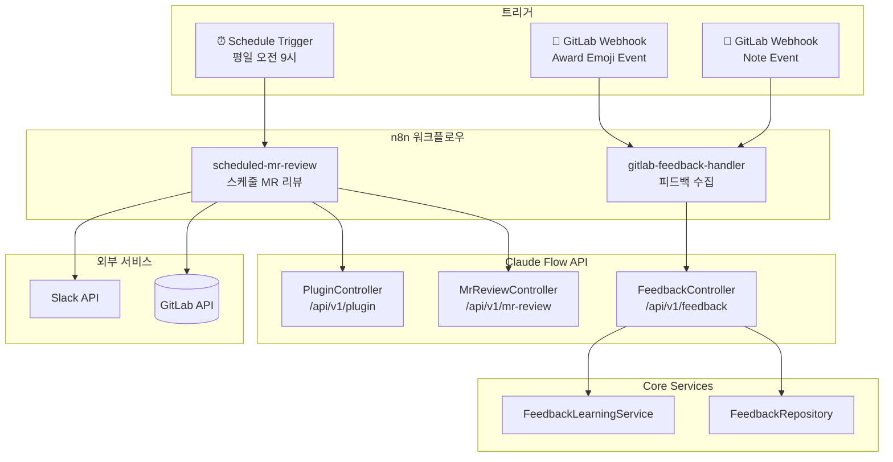

# RFC: 스케줄 기반 MR 자동 리뷰 및 피드백 학습

**상태**: Implemented
**작성일**: 2025-12-27
**구현일**: 2025-12-27
**작성자**: Claude Flow Team

> **구현 노트**: 로컬 환경에서 GitLab Webhook 수신이 어려워 **Polling 방식**으로 변경 구현.
> GitLab 답글 피드백 대신 **대시보드 MR Reviews 페이지**에서 코멘트 관리.

---

## 1. 개요

### 1.1 배경
현재 claude-flow는 Slack에서 MR 리뷰를 요청하면 자동으로 코드 리뷰를 수행합니다.

**요구사항**:
1. **스케줄 기반 자동 리뷰**: 매일 오전에 미리뷰 MR을 자동으로 리뷰
2. **GitLab 피드백 수집**: 개발자가 👍/👎 리액션 또는 답글로 피드백 → 학습

### 1.2 목표
- 개발자가 리뷰 요청 없이도 MR이 자동 리뷰됨
- 피드백(리액션/답글)으로 AI 리뷰 품질 지속 개선
- 기존 Slack 피드백 시스템(`FeedbackLearningService`)과 통합

---

## 2. 현재 시스템 분석

### 2.1 이미 구현된 기능

| 기능 | 구현 상태 | 위치 |
|------|----------|------|
| MR 목록 조회 | ✅ 완료 | `GitLabPlugin.listMergeRequests()` |
| MR diff 조회 | ✅ 완료 | `GitLabPlugin.getMergeRequestChanges()` |
| MR 코멘트 작성 | ✅ 완료 | `GitLabPlugin.postMrComment()` |
| 2-Pass 코드 리뷰 | ✅ 완료 | `MrAnalyzer` |
| Slack 피드백 학습 | ✅ 완료 | `FeedbackLearningService` |
| n8n 피드백 핸들러 | ✅ 완료 | `slack-feedback-handler.json` |

### 2.2 추가 구현 필요

| 기능 | 설명 | 난이도 |
|------|------|--------|
| n8n Schedule Trigger | 스케줄 MR 리뷰 트리거 | 🟢 쉬움 |
| GitLab Webhook (Award Emoji) | 👍/👎 리액션 수신 | 🟢 쉬움 |
| GitLab Webhook (Note) | 답글 코멘트 수신 | 🟢 쉬움 |
| 피드백 저장 확장 | GitLab 소스 피드백 저장 | 🟢 쉬움 |

---

## 3. 아키텍처 설계

### 3.1 전체 흐름

```
┌─────────────────────────────────────────────────────────────────────────┐
│                   Pipeline 1: 스케줄 기반 MR 자동 리뷰                   │
├─────────────────────────────────────────────────────────────────────────┤
│                                                                         │
│  ⏰ Schedule Trigger (Cron: */5 * * * *, 5분마다)                       │
│       │                                                                 │
│       ▼                                                                 │
│  📂 config/projects.json에서 gitlabPath가 있는 프로젝트 로드            │
│       │                                                                 │
│       ▼                                                                 │
│  🔄 For Each Project:                                                   │
│       │                                                                 │
│       ├── 📋 GitLab API: 해당 프로젝트의 MR 조회 (target=develop)       │
│       │                                                                 │
│       ▼                                                                 │
│  🔄 For Each MR:                                                        │
│       ├── 📝 라벨 추가: ai-review::in-progress                          │
│       ├── 📂 diff 조회 + MrAnalyzer 2-Pass 분석                         │
│       ├── 🤖 Claude 리뷰 실행                                           │
│       ├── 💬 GitLab 코멘트 작성 (+ 코멘트 ID 저장)                      │
│       ├── 📝 라벨 업데이트: ai-review::done                             │
│       └── 📢 Slack 알림                                                 │
│                                                                         │
└─────────────────────────────────────────────────────────────────────────┘

┌─────────────────────────────────────────────────────────────────────────┐
│                   Pipeline 2: GitLab 피드백 수집 및 학습                 │
├─────────────────────────────────────────────────────────────────────────┤
│                                                                         │
│  🔔 GitLab Webhook: Award Emoji Event (👍/👎 리액션)                    │
│       │                                                                 │
│       ▼                                                                 │
│  🔍 AI 코멘트인지 확인 (note_id로 조회)                                  │
│       │                                                                 │
│       ▼                                                                 │
│  📊 피드백 저장 (FeedbackRepository)                                    │
│       ├── 👍 thumbsup → positive feedback                              │
│       └── 👎 thumbsdown → negative feedback                            │
│       │                                                                 │
│       ▼                                                                 │
│  🧠 FeedbackLearningService 학습                                        │
│       └── 향후 유사 코드 리뷰 품질 개선                                 │
│                                                                         │
├─────────────────────────────────────────────────────────────────────────┤
│                                                                         │
│  🔔 GitLab Webhook: Note Event (답글 코멘트)                            │
│       │                                                                 │
│       ▼                                                                 │
│  🔍 AI 코멘트에 대한 답글인지 확인                                       │
│       │                                                                 │
│       ▼                                                                 │
│  📊 피드백 저장 (상세 피드백)                                           │
│       └── 답글 내용 분석 (긍정/부정/제안)                               │
│       │                                                                 │
│       ▼                                                                 │
│  🧠 FeedbackLearningService 학습                                        │
│                                                                         │
└─────────────────────────────────────────────────────────────────────────┘
```

### 3.2 컴포넌트 다이어그램



---

## 4. 상세 설계

### 4.1 Pipeline 1: 스케줄 기반 MR 자동 리뷰

#### n8n 워크플로우: `scheduled-mr-review.json`

```json
{
  "name": "Scheduled MR Auto Review",
  "nodes": [
    {
      "name": "Schedule Trigger",
      "type": "n8n-nodes-base.scheduleTrigger",
      "parameters": {
        "rule": {
          "interval": [{ "field": "cronExpression", "expression": "*/5 * * * *" }]
        }
      }
    },
    {
      "name": "Get Subscribed Projects",
      "type": "n8n-nodes-base.httpRequest",
      "parameters": {
        "method": "GET",
        "url": "http://claude-flow:8080/api/v1/projects/gitlab-enabled"
      },
      "notes": "config/projects.json에서 gitlabPath가 있는 프로젝트 목록 조회"
    },
    {
      "name": "Loop Over Projects",
      "type": "n8n-nodes-base.splitInBatches",
      "parameters": { "batchSize": 1 }
    },
    {
      "name": "Get Project MRs",
      "type": "n8n-nodes-base.httpRequest",
      "parameters": {
        "method": "GET",
        "url": "={{ $env.GITLAB_URL }}/api/v4/projects/{{ encodeURIComponent($json.gitlabPath) }}/merge_requests",
        "qs": {
          "state": "opened",
          "target_branch": "develop",
          "labels": "!ai-review::done",
          "per_page": "10"
        },
        "headers": { "PRIVATE-TOKEN": "={{ $env.GITLAB_TOKEN }}" }
      }
    },
    {
      "name": "Loop Over MRs",
      "type": "n8n-nodes-base.splitInBatches",
      "parameters": { "batchSize": 1 }
    },
    {
      "name": "Add In-Progress Label",
      "type": "n8n-nodes-base.httpRequest",
      "parameters": {
        "method": "PUT",
        "url": "={{ $env.GITLAB_URL }}/api/v4/projects/{{ $json.project_id }}/merge_requests/{{ $json.iid }}",
        "body": { "add_labels": "ai-review::in-progress" }
      }
    },
    {
      "name": "Claude Flow MR Analysis",
      "type": "n8n-nodes-base.httpRequest",
      "parameters": {
        "method": "GET",
        "url": "http://claude-flow:8080/api/v1/mr-review/prompt/{{ $json.project_id }}/{{ $json.iid }}"
      }
    },
    {
      "name": "Execute Claude Review",
      "type": "n8n-nodes-base.httpRequest",
      "parameters": {
        "method": "POST",
        "url": "http://claude-flow:8080/api/v1/execute-with-routing",
        "body": {
          "prompt": "={{ $json.fullPrompt }}",
          "agentId": "code-reviewer"
        }
      }
    },
    {
      "name": "Post GitLab Comment",
      "type": "n8n-nodes-base.httpRequest",
      "parameters": {
        "method": "POST",
        "url": "={{ $env.GITLAB_URL }}/api/v4/projects/{{ $json.project_id }}/merge_requests/{{ $json.iid }}/notes",
        "body": {
          "body": "## 🤖 AI Code Review\n\n{{ $json.result }}\n\n---\n👍 도움이 되었다면 이모지를, 👎 개선이 필요하면 답글을 남겨주세요!"
        }
      }
    },
    {
      "name": "Save Review Record",
      "type": "n8n-nodes-base.httpRequest",
      "parameters": {
        "method": "POST",
        "url": "http://claude-flow:8080/api/v1/feedback/gitlab-review",
        "body": {
          "projectId": "={{ $json.project_id }}",
          "mrIid": "={{ $json.iid }}",
          "noteId": "={{ $json.noteId }}",
          "reviewContent": "={{ $json.result }}"
        }
      }
    },
    {
      "name": "Update Label Done",
      "type": "n8n-nodes-base.httpRequest",
      "parameters": {
        "method": "PUT",
        "url": "={{ $env.GITLAB_URL }}/api/v4/projects/{{ $json.project_id }}/merge_requests/{{ $json.iid }}",
        "body": {
          "remove_labels": "ai-review::in-progress",
          "add_labels": "ai-review::done"
        }
      }
    },
    {
      "name": "Slack Notification",
      "type": "n8n-nodes-base.slack",
      "parameters": {
        "channel": "#mr-reviews",
        "text": "🤖 MR 자동 리뷰 완료: {{ $json.title }}\n{{ $json.web_url }}"
      }
    }
  ]
}
```

#### 설정 옵션

| 환경변수 | 설명 | 기본값 |
|---------|------|--------|
| `SCHEDULED_REVIEW_CRON` | 리뷰 스케줄 (Cron) | `*/5 * * * *` (5분마다) |
| `SCHEDULED_REVIEW_TARGET_BRANCH` | 리뷰 대상 타겟 브랜치 | `develop` |
| `SCHEDULED_REVIEW_MAX_MRS` | 프로젝트당 처리할 최대 MR 수 | `10` |

**대상 프로젝트**: `config/projects.json`에서 `gitlabPath`가 정의된 프로젝트만 리뷰 대상

```json
// 예시: 이 프로젝트들만 자동 리뷰 대상
{
  "id": "ccds-server",
  "gitlabPath": "sirius/ccds/ccds-server"  // ← 이 필드가 있으면 리뷰 대상
}
```

---

### 4.2 Pipeline 2: GitLab 피드백 수집

#### GitLab Webhook 설정

```yaml
# GitLab Group > Settings > Webhooks (또는 프로젝트별)
URL: https://n8n.your-domain.com/webhook/gitlab-feedback
Secret Token: ${GITLAB_WEBHOOK_SECRET}
Triggers:
  - Note events (코멘트)
  - Emoji events (리액션)
```

#### n8n 워크플로우: `gitlab-feedback-handler.json`

```json
{
  "name": "GitLab Feedback Handler",
  "nodes": [
    {
      "name": "GitLab Webhook",
      "type": "n8n-nodes-base.webhook",
      "parameters": {
        "path": "gitlab-feedback",
        "httpMethod": "POST"
      }
    },
    {
      "name": "Route by Event Type",
      "type": "n8n-nodes-base.switch",
      "parameters": {
        "rules": [
          { "value": "emoji", "output": 0 },
          { "value": "note", "output": 1 }
        ],
        "value": "={{ $json.object_kind }}"
      }
    },
    {
      "name": "Handle Emoji (👍/👎)",
      "type": "n8n-nodes-base.httpRequest",
      "parameters": {
        "method": "POST",
        "url": "http://claude-flow:8080/api/v1/feedback/gitlab-emoji",
        "body": {
          "projectId": "={{ $json.project_id }}",
          "noteId": "={{ $json.awardable_id }}",
          "emoji": "={{ $json.emoji_name }}",
          "userId": "={{ $json.user.id }}",
          "action": "={{ $json.action }}"
        }
      }
    },
    {
      "name": "Handle Note (답글)",
      "type": "n8n-nodes-base.httpRequest",
      "parameters": {
        "method": "POST",
        "url": "http://claude-flow:8080/api/v1/feedback/gitlab-note",
        "body": {
          "projectId": "={{ $json.project_id }}",
          "noteId": "={{ $json.object_attributes.id }}",
          "parentNoteId": "={{ $json.object_attributes.discussion_id }}",
          "content": "={{ $json.object_attributes.note }}",
          "userId": "={{ $json.user.id }}"
        }
      }
    }
  ]
}
```

#### Feedback API 엔드포인트

```kotlin
// claude-flow-api/src/main/kotlin/ai/claudeflow/api/rest/FeedbackController.kt

@RestController
@RequestMapping("/api/v1/feedback")
class FeedbackController(
    private val feedbackRepository: FeedbackRepository,
    private val feedbackLearningService: FeedbackLearningService
) {

    /**
     * AI 리뷰 기록 저장 (리뷰 코멘트 작성 시 호출)
     */
    @PostMapping("/gitlab-review")
    suspend fun saveGitLabReview(@RequestBody request: GitLabReviewRecord): ResponseEntity<*> {
        feedbackRepository.saveReviewRecord(
            source = "gitlab",
            projectId = request.projectId,
            mrIid = request.mrIid,
            noteId = request.noteId,
            content = request.reviewContent
        )
        return ResponseEntity.ok(mapOf("status" to "saved"))
    }

    /**
     * GitLab 이모지 피드백 처리 (👍/👎)
     */
    @PostMapping("/gitlab-emoji")
    suspend fun handleGitLabEmoji(@RequestBody request: GitLabEmojiEvent): ResponseEntity<*> {
        // AI가 작성한 코멘트인지 확인
        val reviewRecord = feedbackRepository.findByNoteId(request.noteId)
            ?: return ResponseEntity.ok(mapOf("status" to "ignored", "reason" to "not ai comment"))

        // 피드백 저장
        val feedbackType = when (request.emoji) {
            "thumbsup", "+1" -> FeedbackType.POSITIVE
            "thumbsdown", "-1" -> FeedbackType.NEGATIVE
            else -> return ResponseEntity.ok(mapOf("status" to "ignored"))
        }

        feedbackRepository.saveFeedback(
            reviewId = reviewRecord.id,
            type = feedbackType,
            source = "gitlab_emoji",
            userId = request.userId
        )

        // 학습 서비스에 전달
        feedbackLearningService.learn(
            query = reviewRecord.mrContext,
            response = reviewRecord.content,
            feedback = feedbackType,
            userId = request.userId.toString()
        )

        return ResponseEntity.ok(mapOf("status" to "processed", "type" to feedbackType))
    }

    /**
     * GitLab 답글 피드백 처리
     */
    @PostMapping("/gitlab-note")
    suspend fun handleGitLabNote(@RequestBody request: GitLabNoteEvent): ResponseEntity<*> {
        // AI 코멘트의 스레드인지 확인
        val reviewRecord = feedbackRepository.findByDiscussionId(request.parentNoteId)
            ?: return ResponseEntity.ok(mapOf("status" to "ignored"))

        // 답글 내용 분석 (간단한 감정 분석)
        val sentiment = analyzeNoteSentiment(request.content)

        feedbackRepository.saveFeedback(
            reviewId = reviewRecord.id,
            type = sentiment.feedbackType,
            source = "gitlab_note",
            userId = request.userId,
            comment = request.content
        )

        feedbackLearningService.learnFromComment(
            query = reviewRecord.mrContext,
            response = reviewRecord.content,
            userComment = request.content,
            userId = request.userId.toString()
        )

        return ResponseEntity.ok(mapOf("status" to "processed", "sentiment" to sentiment))
    }

    private fun analyzeNoteSentiment(content: String): SentimentResult {
        // 간단한 키워드 기반 감정 분석
        val positiveKeywords = listOf("좋아요", "감사", "도움", "정확", "good", "thanks", "helpful")
        val negativeKeywords = listOf("틀렸", "아니", "잘못", "wrong", "incorrect", "no")

        val lowerContent = content.lowercase()
        return when {
            positiveKeywords.any { it in lowerContent } -> SentimentResult(FeedbackType.POSITIVE)
            negativeKeywords.any { it in lowerContent } -> SentimentResult(FeedbackType.NEGATIVE)
            else -> SentimentResult(FeedbackType.NEUTRAL)
        }
    }
}
```

---

## 5. 피드백 학습 연동

### 5.1 기존 FeedbackLearningService 활용

현재 Slack 피드백에서 사용하는 `FeedbackLearningService`를 GitLab에도 적용:

```kotlin
// 기존 코드 활용 (claude-flow-core/src/main/kotlin/ai/claudeflow/core/rag/FeedbackLearningService.kt)

class FeedbackLearningService(
    private val embeddingService: EmbeddingService,
    private val vectorService: ConversationVectorService
) {
    /**
     * 피드백 학습 - 긍정/부정 피드백에 따라 향후 유사 쿼리 처리 개선
     */
    suspend fun learn(
        query: String,
        response: String,
        feedback: FeedbackType,
        userId: String
    ) {
        // 벡터 저장소에 피드백 메타데이터 추가
        // 향후 유사 쿼리 시 긍정 피드백 받은 응답 패턴 우선
    }
}
```

### 5.2 피드백 대시보드

대시보드에서 GitLab 피드백 통계 확인:

| 항목 | 설명 |
|------|------|
| 총 리뷰 수 | 스케줄/요청 리뷰 총 건수 |
| 👍 비율 | 긍정 피드백 비율 |
| 👎 비율 | 부정 피드백 비율 |
| 답글 피드백 | 상세 코멘트 건수 |
| 학습 효과 | 시간에 따른 긍정 비율 변화 |

---

## 6. 구현 계획

### Phase 1: 데이터 모델 확장 ✅

- [x] `Storage.kt` - `gitlab_reviews` 테이블 생성
- [x] `FeedbackRepository.kt` - GitLab 관련 CRUD 메서드 추가
- [x] `ExecutionRecord.kt` - `GitLabReviewRecord`, `GitLabFeedbackType` 추가

### Phase 2: API 엔드포인트 ✅

- [x] `ProjectsController.kt` - `/gitlab-enabled` 엔드포인트 추가
- [x] `GitLabFeedbackController.kt` - 신규 생성
  - `POST /api/v1/feedback/gitlab-review` - AI 리뷰 기록 저장
  - `POST /api/v1/feedback/gitlab-emoji` - 이모지 피드백 처리
  - `GET /api/v1/feedback/gitlab-stats` - 피드백 통계
  - `GET /api/v1/feedback/gitlab-reviews` - 리뷰 목록 (대시보드용)

### Phase 3: FeedbackLearningService 연동 ✅

- [x] `learnFromGitLabFeedback()` 메서드 추가
- [x] `learnFromComment()` 메서드 추가
- [x] `analyzeCommentSentiment()` 헬퍼 추가

### Phase 4: n8n 워크플로우 ✅

- [x] `scheduled-mr-review.json` - 스케줄 MR 자동 리뷰 (5분마다)
- [x] `gitlab-feedback-poller.json` - Polling 방식 피드백 수집 (Webhook 대체)

### Phase 5: 대시보드 ✅

- [x] `GitLabReviews.tsx` - MR Reviews 페이지 추가
- [x] 리뷰 기록 목록 표시
- [x] 이모지 피드백 표시 (👍/👎)
- [x] 대시보드에서 코멘트 작성 기능

---

## 7. 리뷰 코멘트 포맷

### 7.1 자동 리뷰 코멘트 예시

```markdown
## 🤖 AI Code Review

### 요약
이 MR은 사용자 인증 로직을 개선합니다.

### 발견된 이슈

#### ⚠️ 보안 주의
- `UserService.kt:42` - 비밀번호를 평문으로 로깅하고 있습니다.

#### 💡 개선 제안
- `AuthController.kt:15` - JWT 만료 시간을 환경변수로 분리하면 좋겠습니다.

### 전체 평가
✅ **Approve** - 보안 이슈 수정 후 머지 가능

---
👍 도움이 되었다면 이모지를, 👎 개선이 필요하면 답글을 남겨주세요!
```

### 7.2 피드백 수집 방법

| 방법 | 액션 | 의미 |
|------|------|------|
| 👍 리액션 | 코멘트에 thumbsup | 리뷰가 도움이 됨 |
| 👎 리액션 | 코멘트에 thumbsdown | 리뷰가 부정확/불필요 |
| 답글 | 코멘트에 답글 작성 | 상세 피드백 (어떤 점이 좋았는지/나빴는지) |

---

## 8. 결론

### 8.1 구현 완료 요약

| 기능 | 상태 | 구현 내용 |
|------|------|----------|
| 스케줄 기반 MR 자동 리뷰 | ✅ 완료 | `scheduled-mr-review.json` (5분마다) |
| GitLab 코멘트 자동 작성 | ✅ 완료 | 워크플로우에서 GitLab API 호출 |
| 👍/👎 이모지 피드백 수집 | ✅ 완료 | Polling 방식 (`gitlab-feedback-poller.json`) |
| 대시보드 피드백 관리 | ✅ 완료 | `GitLabReviews.tsx` 페이지 |
| 피드백 기반 학습 | ✅ 완료 | `FeedbackLearningService` 연동 |

### 8.2 구현 변경사항

**원래 계획 vs 실제 구현:**

| 항목 | 원래 계획 | 실제 구현 |
|------|----------|----------|
| 피드백 수집 방식 | GitLab Webhook | Polling (로컬 환경 호환) |
| 답글 피드백 | GitLab 답글 수집 | 대시보드 코멘트 기능 |
| Slack 알림 | 리뷰 완료 시 알림 | 없음 (GitLab 코멘트만) |

### 8.3 파일 목록

**Backend (Kotlin):**
- `claude-flow-core/src/main/kotlin/ai/claudeflow/core/storage/Storage.kt`
- `claude-flow-core/src/main/kotlin/ai/claudeflow/core/storage/ExecutionRecord.kt`
- `claude-flow-core/src/main/kotlin/ai/claudeflow/core/storage/repository/FeedbackRepository.kt`
- `claude-flow-core/src/main/kotlin/ai/claudeflow/core/rag/FeedbackLearningService.kt`
- `claude-flow-api/src/main/kotlin/ai/claudeflow/api/rest/ProjectsController.kt`
- `claude-flow-api/src/main/kotlin/ai/claudeflow/api/rest/GitLabFeedbackController.kt`

**n8n Workflows:**
- `docker-compose/n8n-workflows/scheduled-mr-review.json`
- `docker-compose/n8n-workflows/gitlab-feedback-poller.json`

**Dashboard (React):**
- `dashboard/src/pages/GitLabReviews.tsx`
- `dashboard/src/lib/api.ts`
- `dashboard/src/types/index.ts`
- `dashboard/src/components/Sidebar.tsx`
- `dashboard/src/App.tsx`
